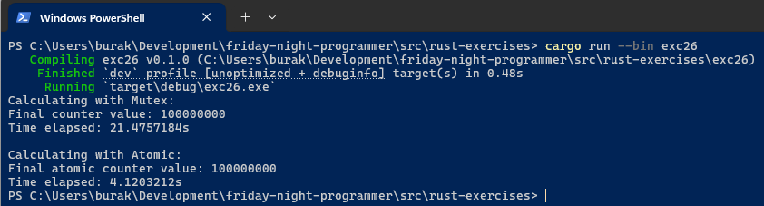

# Rust Kodlama İdmanları

Bu dokümanda rust bilgilerimizi tazelemek için çeşitli kaynaklardan derlediğim örneklere yer verilmektedir. Amaç başlangıç, orta ve ileri seviyede rust konularına yer vererek bilgileri tazelemek ve pratikler yapmaktır.

## İçerik

### **Başlangıç Seviyesi**

Rust'ın temel kavramları ve güvenli programlama pratikleri:

- **[exc00](#unwrapexpect-tuzaklarından-kaçınmak-exc00)** - Unwrap/Expect Tuzaklarından Kaçınmak
- **[exc01](#gereksiz-clone-çağrılarından-kaçınmak-exc01)** - Gereksiz clone Çağrılarından Kaçınmak  
- **[exc02](#mutasyon-kapsamını-sınırlamak-exc02)** - Mutasyon Kapsamını Sınırlamak
- **[exc03](#dangling-referanslardan-kaçınmak-exc03)** - Dangling Referanslardan Kaçınmak
- **[exc04](#public-apilerde-kapsamlı-dokümantasyon-kullanmak-exc04)** - Public API'lerde Kapsamlı Dokümantasyon Kullanmak
- **[exc15](#sahipliği-gözardı-etmek-ignoring-ownership-exc15)** - Sahipliği Gözardı Etmek (Ignoring Ownership)
- **[exc16](#makroları-hatalı-kullanmaktan-kaçınmak-exc16)** - Makroları Hatalı Kullanmaktan Kaçınmak
- **[exc17](#string-yerine-str-ile-çalışmak-exc17)** - String Yerine &str ile Çalışmak
- **[exc18](#if-let-ile-daha-temiz-eşleşmeler-exc18)** - if let ile Daha Temiz Eşleşmeler

### **Orta Seviye**

Daha gelişmiş Rust teknikleri ve tasarım desenleri:

- **[exc05](#composition-over-inheritance-ile-daha-modüler-tasarım-exc05)** - Composition Over Inheritance ile Daha Modüler Tasarım
- **[exc06](#daha-kapsamlı-test-senaryoları-yazmak-exc06)** - Daha Kapsamlı Test Senaryoları Yazmak
- **[exc09](#lazy-iterator-kullanımı-ile-bellek-verimliliğini-artırmak-exc09)** - Lazy Iterator Kullanımı ile Bellek Verimliliğini Artırmak
- **[exc10](#generic-türlerde-kısıtlamaları-constraint-kullanmak-exc10)** - Generic Türlerde Kısıtlamaları (Constraint) Kullanmak
- **[exc11](#daha-güçlü-hata-yönetimi-için-custom-error-türleri-oluşturmak-veya-thiserror-kullanmak-exc11)** - Custom Error Türleri / thiserror Kullanmak
- **[exc19](#tip-dönüşümlerinde-from-ve-into-traitlerini-kullanmak-exc19)** - Tip Dönüşümlerinde From ve Into Trait'lerini Kullanmak
- **[exc20](#generic-traitlerde-associated-types-kullanımı-exc20)** - Generic Trait'lerde Associated Types Kullanımı
- **[exc21](#iterator-adaptörleri-ve-collect-kullanımı-exc21)** - Iterator Adapter'ları ve Collect Kullanımı
- **[exc22](#module-gizleme-ve-erişim-kontrolü-exc22)** - Module Gizleme ve Erişim Kontrolü

### **İleri Seviye**

Performans, güvenlik ve sistem programlama konuları:

- **[exc07](#unsafe-kodları-soyutlamalar-ile-sarmak-exc07)** - Unsafe Kodları Soyutlamalar ile Sarmak
- **[exc08](#eşzamanlı-concurrency-paylaşılan-durumlarda-kilitlenme-ve-yarış-durumlarından-data-races-kaçınmak-exc08)** - Eşzamanlı Paylaşılan Durumlarda Kilitlenme ve Yarış Durumlarından Kaçınmak
- **[exc12](#spawn-blocking-tasks-ile-asenkron-kodlarda-performans-artışı-sağlamak-exc12)** - Spawn Blocking Tasks ile Asenkron Kodlarda Performans Artışı
- **[exc13](#typestate-pattern-ile-daha-güvenli-apiler-tasarlamak-exc13)** - Typestate Pattern ile Daha Güvenli API'ler Tasarlamak
- **[exc14](#uygulama-düzeyinde-hata-yayılımı-error-propagation-için-anyhow-kullanmak-exc14)** - Uygulama Düzeyinde Hata Yayılımı için anyhow Kullanmak
- **[exc23](#ffi-foreign-function-interface-kullanımlarında-unsafe-ile-güvenli-soyutlamalar-oluşturmak-exc23)** - FFI (Foreign Function Interface) Kullanımlarında Unsafe ile Güvenli Soyutlamalar Oluşturmak
- **[exc24](#eşzamanlılık-concurrency-garantisi-için-send-ve-sync-traitlerini-kullanmak-exc24)** - Eşzamanlılık (Concurrency) Garantisi için Send ve Sync Trait'lerini Kullanmak
- **[exc25](#eşzamanlı-garantilerde-mutex-mutual-exclusion-yerine-atomic-türleri-kullanmak-exc25)** - Eşzamanlı Garantilerde Mutex Yerine Atomic Türleri Kullanmak

---

## Başlangıç Seviyesi

### Unwrap/Expect Tuzaklarından Kaçınmak (exc00)

Rust'ın güçlü yönlerinden birisi **Option< T >** ve **Result<T, E>** tipleri ile hata yönetimidir. Bazen özellikle geliştirme safhasındayken **unwrap** ve **expect** kullanarak ilerleyebiliriz zira **match** veya **if let** kullanmak kodu uzatabilir. Ancak bu yaklaşım üretim kodunda ciddi problemlere yol açabilir.

Örneğin bir sistemin açılırken kritik bir yapılandırma dosyasını okumaya çalıştığını düşünelim. Dosyanın bulunamaması veya okuma sırasında bir hata alınması halinde programın paniklemesi yerine kullanıcıya anlamlı bir hata mesajı döndürmek veya izlenebilir, tedbir alınabilir bir makine logu bırakmak daha sağlıklı olacaktır.

```rust
use std::fs;

// Kötü pratik: unwrap ve expect kullanımı
#[allow(dead_code)]
fn read_file(path: &str) -> String {
    fs::read_to_string(path).unwrap()
}

// İyi pratik: Hata yönetimi ile dosya okuma
fn read_file_safely(path: &str) -> Result<String, std::io::Error> {
    fs::read_to_string(path)
}

fn main() {
    // let content = read_file("appSettings.json");
    // println!("{}", content);

    match read_file_safely("appSettings.json") {
        Ok(content) => println!("{}", content),
        Err(e) => {
            if e.kind() == std::io::ErrorKind::NotFound {
                println!("Dosya bulunamadı: {}", e);
            } else {
                println!("Dosya okunurken bir hata oluştu: {}", e);
            }
        }
    }

    println!("Paniksiz günler dilerim!");
}
```

### Gereksiz clone Çağrılarından Kaçınmak (exc01)

Rust sahiplik *(ownership)* modelinde özellikle **Vector**, **String** gibi heap bellek bölgesinde değerlendirilen veri yapıları kapsamlar *(scopes)* arasında taşınırken varsayılan olarak sahipliğin aktarımı söz konusudur. Eğer veri yapısı taşındığı fonksiyonda bir değişikliğe, başka bir deyişle mutasyona uğramayacaksa tüm veri yapısını klonlayarak göndermek yerine referans ile göndermek daha performanslı ve bellek dostu bir yaklaşımdır. Söz gelimi büyük bir sayı listesinin vektör veri yapısında ele alındığını düşünelim. Bu sayı kümesinin matematiksel bir analiz fonksiyonu işleten bir metot tarafından da kullanıldığını varsayalım. Analizi yapan fonksiyon veriyi değiştirmeyeceği için tüm vektörün klonlanması yerine referans ile gönderilmesi daha doğru olacaktır.

```rust
// Kötü pratik: ownership alan fonksiyon kullanımı
#[allow(dead_code)]
fn calculate_bad(data: Vec<i32>) -> i32 {
    let sum: i32 = data.iter().sum();
    sum / (data.len() as i32)
}

// Tercih edilen pratik: referans ile veri geçme
fn calculate(data: &[i32]) -> i32 {
    let sum: i32 = data.iter().sum();
    sum / (data.len() as i32)
}

fn main() {
    /*
     Aşağıdaki kullanım value moved here hatası verir çünkü calculate fonksiyonu ownership'i alır ve data'yı kullanır.

     Sık yapılan çözümlerden birisi vektörü klonlamaktır ancak bu performans açısından maliyetlidir.
     Eğer veri değişmeyecekse, ownership almak yerine referans ile geçmek daha iyidir.

     error[E0382]: borrow of moved value: `numbers`
    --> exc01\src\main.rs:11:22
    |
    7  |     let numbers = vec![10, 20, 30, 40, 50];
    |         ------- move occurs because `numbers` has type `Vec<i32>`, which does not implement the `Copy` trait
    8  |     let result = calculate(numbers);
    |                            ------- value moved here
    ...
    11 |     println!("{:?}", numbers);
    |                      ^^^^^^^ value borrowed here after move
    |
    note: consider changing this parameter type in function `calculate` to borrow instead if owning the value isn't necessary
    --> exc01\src\main.rs:1:20
    |
    1  | fn calculate(data: Vec<i32>) -> i32 {
    |    ---------       ^^^^^^^^ this parameter takes ownership of the value
    |    |
    |    in this function
    = note: this error originates in the macro `$crate::format_args_nl` which comes from the expansion of the macro `println` (in Nightly builds, run with -Z macro-backtrace for more info)
    help: consider cloning the value if the performance cost is acceptable
    |
    8  |     let result = calculate(numbers.clone());
    |                                   ++++++++

    */
    let numbers = vec![10, 20, 30, 40, 50];

    // Bad practice: ownership alan fonksiyon kullanımı
    // // let result = calculate_bad(numbers);
    // let result = calculate_bad(numbers.clone()); // Performans maliyeti var
    // println!("Sonuç: {}", result);

    // println!("{:?}", numbers);

    // Good practice: referans ile veri geçme
    let result = calculate(&numbers);
    println!("Sonuç: {}", result);
    println!("{:?}", numbers);
}
```

### Mutasyon Kapsamını Sınırlamak (exc02)

Rust programlama dilinde değişkenler varsayılan olarak **immutable** *(değiştirilemez)* olarak tanımlanır. Değişkenin değerini değiştirmek istediğimizde `mut` anahtar kelimesi ile değişkeni **mutable** *(değiştirilebilir)* olarak tanımlamamız gerekir. Mutasyonu mümkün olan en dar kapsamda kullanmak kod okunurluğu ve güvenliğini artıran bir pratiktir. Örneğin bileşik faiz hesaplaması yapan bir muhasebe fonksiyonunda döngü içinde güncellenen belli değişkenler olduğunu düşünelim. Bu değişkenler sadece döngü içinde güncellenir ve ihtiyaç duyduğu ara değerler değiştirilemez *(immutable)* olarak tanımlanıp kullanılabilir. Aşağıdaki örnekte bu prensibi uygulayan bir bileşik faiz hesaplama fonksiyonu yer almaktadır.

```rust
fn calculate_compound_interest(principal: f64, annual_rate: f64, years: u32) -> f64 {
    let mut current_amount = principal;
    let mut total_interest = 0.0;

    for year in 1..=years {
        let yearly_interest = current_amount * annual_rate / 100.0;
        current_amount += yearly_interest;
        total_interest += yearly_interest;
        
        println!("Year {}: Interest earned: {:.2}, Total amount: {:.2}", 
                 year, yearly_interest, current_amount);
    }

    total_interest
}

fn main() {
    let principal = 1000.0;
    let annual_rate = 4.5;
    let years = 3;

    let total_interest = calculate_compound_interest(principal, annual_rate, years);
    let final_amount = principal + total_interest;
    
    println!("\nSummary:");
    println!("Principal amount: {:.2}", principal);
    println!("Annual interest rate: {:.1}%", annual_rate);
    println!("Time period: {} years", years);
    println!("Total compound interest earned: {:.2}", total_interest);
    println!("Final amount: {:.2}", final_amount);
}
```

### Dangling Referanslardan Kaçınmak (exc03)

Rust'ın güçlü sahiplik *(ownership)* ve borçlanma *(borrowing)* modeli, dangling *(Sarkmış)* referansların oluşmasını derleme zamanında engeller. Dangling referanslar, bir değişkenin kapsamı dışına çıktıktan sonra ona erişmeye çalıştığımızda ortaya çıkar ve bu durum bellek güvenliği sorunlarına yol açabilir. Rust, bu tür hataların oluşmasını önlemek için katı kurallar uygular. **Borrow Checker** prensiplerine göre bir referansın atıfta bulunduğu değerden daha uzun yaşaması mümkün değildir. Dangling *(Sarkmış)* referanslar genelde bir fonksiyonun local bir değere referans döndürmeye çalışması sırasında ortaya çıkan kritik bir bellek güvenliği hatasıdır.

**N** sayıda cümleyi **literal string** olarak tutan bir dizideki en uzun cümleyi bulmaya çalışan bir fonksiyon yazdığımızı düşünelim. En uzun cümleyi referans olarak döndürmeye çalışırsak, fonksiyonun kapsamı sona erdiğinde taşınan dizinin bellekten silinmesiyle birlikte döndürdüğümüz referansın geçersiz hale gelmesi söz konusu olur ve sorunu çözmek için karmaşık lifetime annotasyonları kullanmamız gerekir. Bunun yerine en uzun cümleyi sahiplenen bir String olarak döndürmek daha doğru bir yaklaşımdır.

```rust
// // Kötü pratik: Dangling referans sorunu oluşması ve lifetime kullanma gerekliliği
// fn find_longest_sentence_badly(lines: &[&str]) -> &str {
//     let mut longest: &str = "";
//     for &line in lines {
//         if line.len() > longest.len() {
//             longest = line;
//         }
//     }
//     longest
// }

// Doğru pratik: String döndürme
fn find_longest_sentence_safely(lines: &[&str]) -> String {
    let mut longest = String::new();
    for line in lines {
        if line.len() > longest.len() {
            longest = line.to_string();
        }
    }
    longest
}

fn main() {
    let lines = vec![
        "Rust is a systems programming language.",
        "It is designed for performance and safety.",
        "Ownership and borrowing are key concepts in Rust.",
    ];

    /*
    Bu fonksiyon dangling referans hatasına neden olur ve ayrıca derleme zamanında 'expected named lifetime parameter' hatası verir.
    Sorunu çözmek için fonksiyon imzasına yaşam süresi parametreleri eklemek gerekir.
    Bunun yerine en uzun cümleyi String olarak döndürmek daha güvenlidir.

    error[E0106]: missing lifetime specifier
    --> exc03\src\main.rs:2:51
    |
    2 | fn find_longest_sentence_badly(lines: &[&str]) -> &str {
    |                                       -------     ^ expected named lifetime parameter
    |
    = help: this function's return type contains a borrowed value, but the signature does not say which one of `lines`'s 2 lifetimes it is borrowed from
    help: consider introducing a named lifetime parameter
    |
    2 | fn find_longest_sentence_badly<'a>(lines: &'a [&'a str]) -> &'a str {
    |                               ++++         ++   ++           ++

    For more information about this error, try `rustc --explain E0106`.

    */

    // let longest_sentence = find_longest_sentence_badly(&lines);
    // println!("En uzun cümle (kötü pratik): {}", longest_sentence);

    let longest_sentence = find_longest_sentence_safely(&lines);
    println!("En uzun cümle (iyi pratik): {}", longest_sentence);
}
```

### Public API'lerde Kapsamlı Dokümantasyon Kullanmak (exc04)

Rust'ın güçlü yanlarından birisi zengin dokümantasyon desteğidir. Özellikle public API'ler geliştirirken kapsamlı dokümantasyon kullanmak, kullanıcıların fonksiyonların nasıl kullanılacağını ve ne işe yaradığını anlamalarına yardımcı olur. **pub** erişim belirleyicisi ile işaretlenmiş tüm enstrümanlarda zengin dokümantasyon yorumları kullanmak gerekir.

```rust
/// Verilen bir fonksiyonun türevini yaklaşık olarak hesaplar.
///
/// # Argümanlar
/// * `f` - Türevini almak istediğimiz fonksiyon.
/// * `x` - Türevini hesaplamak istediğimiz nokta.
/// * `h` - Küçük bir değer, türev hesaplamasında kullanılır (varsayılan: 1e-7).
/// # Dönüş Değeri
/// * `f` fonksiyonunun `x` noktasındaki yaklaşık türevi.
pub fn derivative<F>(f: F, x: f64, h: f64) -> f64
where
    F: Fn(f64) -> f64,
{
    (f(x + h) - f(x - h)) / (2.0 * h)
}

/// Verilen bir fonksiyonun belirli bir aralıktaki integralini yaklaşık olarak hesaplar.
///
/// # Argümanlar
/// * `f` - İntegralini almak istediğimiz fonksiyon.
/// * `a` - İntegral başlangıç noktası.
/// * `b` - İntegral bitiş noktası.
/// * `n` - İntegral hesaplamasında kullanılacak dikdörtgen sayısı (varsayılan: 1000).
/// # Dönüş Değeri
/// * `f` fonksiyonunun `[a, b]` aralığındaki yaklaşık integrali.
pub fn integral<F>(f: F, a: f64, b: f64, n: usize) -> f64
where
    F: Fn(f64) -> f64,
{
    let width = (b - a) / (n as f64);
    let mut total_area = 0.0;

    for i in 0..n {
        let x = a + (i as f64 + 0.5) * width;
        total_area += f(x) * width;
    }

    total_area
}

#[cfg(test)]
pub mod tests {
    use super::*;

    #[test]
    fn test_derivative() {
        let f = |x: f64| x.powi(2);
        let deriv_at_3 = derivative(f, 3.0, 1e-7);
        assert!((deriv_at_3 - 6.0).abs() < 1e-5);
    }

    #[test]
    fn test_integral() {
        let f = |x: f64| x;
        let integral_result = integral(f, 0.0, 1.0, 1000);
        assert!((integral_result - 0.5).abs() < 1e-5);
    }
}
```

ve modül içinde aşağıdaki gibi ilerlenebilir.

```rust
//! # Calculus Modülü
//!
//! Bu modül, temel matematiksel işlemleri gerçekleştiren fonksiyonlar içerir.
//! Örnek olarak, türev ve integral hesaplamaları için fonksiyonlar sağlar.
//!
//! # Örnekler
//! ```rust
//! mod calculus;
//!
//! use calculus::{derivative, integral};
//! fn main() {
//!   let f = |x: f64| x.powi(2);
//!   let deriv_at_3 = derivative(f, 3.0, 1e-7);
//!   println!("f'(3) yaklaşık olarak: {}", deriv_at_3); // Yaklaşık 6.0
//!   let integral_result = integral(f, 0.0, 1.0, 1000);
//!   println!("∫f(x)dx from 0 to 1 yaklaşık olarak: {}", integral_result); // Yaklaşık 0.3333
//! }
//! ```

pub mod calculus;
```

### Sahipliği Gözardı Etmek (Ignoring Ownership) (exc15)

Rust' ın sahiplik *(ownership)* sisteminin bir dizi kuralı vardır. Bunlardan birisi de bir değerin yalnızca bir sahibinin olabileceğidir. Sahipliği alınan bir değer kapsam dışına çıktığında **move** işlemi gerçekleşir ve bellekten silinir *(drop)*. Başka bir değişkene atama yaptığımızda ise verinin sahipliği aktarılır ve bu durumda da orjinal değişken kullanılmaz hale gelir. Ancak bazı durumlarda sahipliği göz ardı etmek mümkündür. Bunu daha çok farklı scope'lara veri taşıyan değişkenler kullandığımızda ele alırız.  Söz gelimi bir web sunucusuna gelen istekleri işlerken **HTTP Body** içeriğini temsil eden bir String nesnesini, bir doğrulama fonksiyonuna geçirdikten sonra orjinal değişkeni de kullanmaya devam etmek istediğimizi düşünelim. Bu durumda sahipliği göz ardı ederek veriyi referans yoluyla geçmek en doğru ve maliyetsiz yaklaşım olacaktır. Aşağıdaki örnekte kod parçasında bu durum hem sahipliği devralan hem de sahipliği göz ardı eden iki fonksiyonla ele alınmaktadır.

```rust
// Sahipliği devralan fonksiyon
fn validate_with_ownership(input: String) -> bool {
    // Basit bir doğrulama: Şimdilik gelen veri içeriği boş değilse geçerli kabul ediyoruz
    !input.trim().is_empty()
    // input değişkeni fonksiyonun sonunda scope dışına çıktığında bellekten otomatik olarak temizlenecektir
}

// Sahipliği göz ardı eden fonksiyon
fn validate_without_ownership(input: &str) -> bool {
    // Basit bir doğrulama: Şimdilik gelen veri içeriği boş değilse geçerli kabul ediyoruz
    !input.trim().is_empty()
}

fn main() {
    let user_input = String::from("<body><title>Request Form</title></body>");

    // Fonksiyona sahipliği devretmiyoruz, sadece referansını geçiriyoruz
    let is_valid = validate_without_ownership(&user_input);

    if is_valid {
        println!("Request is valid: {}", user_input);
    } else {
        println!("Invalid request.");
    }

    // user_input bu scope içerisinde hala kullanılabilir durumda çünkü sahipliği ilgili fonksiyonuna geçmedik
    println!("Original input is still available: {}", user_input);

    /*
        Aşağıdaki kullanımda owned_input değişkeninin sahipliği validate_with_ownership fonksiyonuna
        devredildiği için, fonksiyon çağrısından sonra owned_input değişkeni geçersiz hale gelir.
        Bu nedenle, fonksiyon çağrısından sonra owned_input değişkenine erişmeye çalışmak
        derleme hatasına neden olur. 

        error[E0382]: borrow of moved value: `owned_input`
        --> exc15\src\main.rs:35:23
        |
        27 |     let owned_input = String::from("<body><title>Owned Request Form</title></body>");
        |         ----------- move occurs because `owned_input` has type `String`, which does not implement the `Copy` trait
        28 |     // Fonksiyona sahipliği devrediyoruz
        29 |     let is_owned_valid = validate_with_ownership(owned_input);
        |                                                  ----------- value moved here
        ...
        35 |     let body_length = owned_input.len(); // Hata: owned_input artık geçerli değil
        |                       ^^^^^^^^^^^ value borrowed here after move
        |
        note: consider changing this parameter type in function `validate_with_ownership` to borrow instead if owning the value isn't necessary
        --> exc15\src\main.rs:1:35
        |
        1  | fn validate_with_ownership(input: String) -> bool {
        |    -----------------------        ^^^^^^ this parameter takes ownership of the value
        |    |
        |    in this function
        help: consider cloning the value if the performance cost is acceptable
        |
        29 |     let is_owned_valid = validate_with_ownership(owned_input.clone());
        |                                                             ++++++++

        For more information about this error, try `rustc --explain E0382`.
        warning: `exc15` (bin "exc15") generated 1 warning

        Burada fonksiyona referans yolu ile sahipliği devrederek ilerlemek daha güvenlidir.
        Ya da maliyetine katlanarak klonlama (clone) yapabiliriz.
        Hatta çağırılan fonksiyondan geriye yeni bir String dönerek sahipliği koruyabiliriz. 
        Ancak bu senaryoda ideal olan referans ile geçiş yapmaktır.
    */
    // let owned_input = String::from("<body><title>Owned Request Form</title></body>");
    // // Fonksiyona sahipliği devrediyoruz
    // let is_owned_valid = validate_with_ownership(owned_input);
    // if is_owned_valid {
    //     println!("Owned request is valid.");
    // } else {
    //     println!("Invalid owned request.");
    // }
    // let body_length = owned_input.len(); // Hata: owned_input artık geçerli değil
}
```

### Makroları Hatalı Kullanmaktan Kaçınmak (exc16)

Makrolar **metadata** programlamada oldukça işimize yarayan rust'ın güçlü enstrümanlarından birisidir. Makroları kullanarak kod üreten kodlar yazabilir, derleme sırasında kodu değiştirebiliriz. Genellikle tekrarlı işler için bu makro kullanımı çok yaygındır. Hatta Rust'ı öğrenmeye başladığımız andan itibaren ilk makromuzu da kullanırız *(println!)* Bilindiği üzere ! işareti ile biten metotlar birer makrodur.

Ancak makroların yanlış kullanımı kodun okunurluğunu ve bakımını zorlaştırabilir. Mesela çok basit görevler için makro kullanmak yerine fonksiyonlardan yararlanmak daha doğrudur. Bu sayede kodun anlaşılması ve hataların ayıklanması daha kolay olur. Örneğin basit loglama operasyonlarında makro kullanmak yerine fonksiyon kullanımı tercih edilebilir. Aşağıdaki kod parçasında kötü ve ideal kullanım örnekleri basitçe ele alınmaktadır.

```rust
/*
    Log bırakmak için makro kullanmak yerine fonksiyon kullanmak kodun okunurluğunu daha da basitleştirir.
    Bir makroda genellikle expression ve çeşitli regex patternler kullanılır. Bu da kodun anlaşılmasını zorlaştırabilir.
    Özellikle basit işlemler için makro kullanmak yerine fonksiyon kullanmak çok daha kolaydır.
*/
macro_rules! log {
    ($msg:expr, $level:expr) => {
        println!("[{}]: {}", $level, $msg);
    };
}

/// Basit bir log fonksiyonu. 
/// Mesajı, log seviyesini alır ve formatlı bir şekilde ekrana basar.
///
/// # Arguments
/// * `message` - Log mesajı.
/// * `level` - Log seviyesi (örneğin: "INFO", "WARN", "ERROR").
fn log(message: &str, level: &str) {
    println!("[{}]: {}", level, message);
}

fn main() {
    log!("This is a warning message.", "WARN");

    log("This is an info message.", "INFO");
    log("This is an error message.", "ERROR");
}
```

### String Yerine &str ile Çalışmak (exc17)

Programlar belleğin **stack** ve **heap** bölgelerini kullanarak çalışırlar. **Heap** bellek bölgesi çok daha büyüktür ve rastgele okuma/yazma işlemleri sıklıkla gerçekleşir. Maliyet açısından bakıldığında en külfetli operasyonlar heap bölgesinde icra edilir *(Yer tahsis işlemleri, veri taşıma operasyonları, serbest bırakmalar vb.)* Özellikle veri okuma operasyonlarında **heap allocation** maliyetini minimize etmek için referanslarla çalışmak tercih edilen bir yaklaşımdır. Bir başka deyişle bu operasyonlarda ödünç alınabilen **&str** referansları kullanmak performans açısından daha iyidir. **&str**, literal string verilerini temsil eden bir referanstır ve **heap** üzerinde yeni bir **String** nesnesi oluşturmaya gerek kalmadan veri okuma işlemlerini mümkün kılar. Tabii burada veri üzerinde değişiklik yapmayacağımızı kabul etmemiz gerekiyor. Yani sahipliğin devredilmesi veya verinin değiştirilmesi gereken durumlarda yine **String** türü ile çalışmak gerekir.

Bir web suncusuna gelen isteklerin yönlendirilmesi ile ilgili bir kod parçası geliştirdiğimizi düşünelim. HTTP isteklerine ait yol bilgilerini ele alırken, verinin kopyası üzerinden ilerlemek yerine referans kullanarak ilerlemek daha az bellek tüketimi sağlayacaktır zira gereksiz yer tahsisi operasyonuna *(heap allocation)* gerek kalmaz.

Aşağıdaki örnek kod parçasında bu senaryo basit bir şekilde ele alınmaktadır.

```rust
fn main() {
    let api_paths = vec![
        String::from("/api/v1/users"),
        String::from("/api/v1/orders"),
        String::from("/api/v1/products"),
    ];

    for path in api_paths {
        // // Bad Practice
        // route_request_owned(path.clone());

        // Good Practice
        route_request(&path);
    }
}

// Bad Practice: Kopya üzerinden işlem yapmak
#[allow(dead_code)]
fn route_request_owned(path: String) {
    match path.as_str() {
        "/api/v1/users" => println!("Routing to Users API"),
        "/api/v1/orders" => println!("Routing to Orders API"),
        "/api/v1/products" => println!("Routing to Products API"),
        _ => println!("404 Not Found"),
    }
}

// Good Practice: Referans üzerinden işlem yapmak
fn route_request(path: &str) {
    match path {
        "/api/v1/users" => println!("Routing to Users API"),
        "/api/v1/orders" => println!("Routing to Orders API"),
        "/api/v1/products" => println!("Routing to Products API"),
        _ => println!("404 Not Found"),
    }
}
```

Dikkat edileceği üzere **api_paths** dizisindeki her bir yol bilgisi için **route_request** fonksiyonu çağrılırken bir referans türü olarak **&str** kullanılmıştır. Yine de ısrarla kopya üzerinden işlem yapmak istersek **clone** metodu ile kopyalama yapılarak ilerlenebilir ancak bu durumda da performans maliyeti ortaya çıkar. Çünkü her bir kopyalama işlemi için heap üzerinde yeni bir alan tahsis edilir ve bu da gereksiz bellek tüketimi demektir. Referans kullanımı ise bu maliyeti ortadan kaldırır.

### if let ile Daha Temiz Eşleşmeler (exc18)

Bir match ifadesinin tek bir varyantının ele alındığı durumlarda daha kısa ve temiz bir sözdizimi olarak **if let** kullanımı tercih edilebilir zira kod okunurluğu artar. **if let** ifadelerini de **Option**, **Result** veya **enum** türleri ile kullanmak mümkündür. Söz gelimi doğrulanmış *(Authenticated)* bir kullanıcının sisteme girdikten sonra profil bilgilerini almak istediğimizi düşünelim. Kullanıcının profil bilgileri doğrulanmışsa bu bilgileri ekrana basmak aksi durumda bir hata mesajı göstermek istiyoruz. Bu durumda **if let** kullanımı **match** ifadesine göre daha kısa ve anlaşılır olacaktır. **if let** daha çok tek bir durumu ele almak istediğimiz senaryolarda gerçekten idealdir. Aşağıdaki örnek kod parçasında **match** ve **if let** kullanımları karşılaştırılmaktadır.

```rust
/// Doğrulanmış ve doğrulanmamış kullanıcıları temsil eden bir enum tanımı
enum AuthenticatedUser {
    /// Doğrulanmış kullanıcı bilgilerini tutar
    Verified { username: String, email: String },
    /// Doğrulanmamış kullanıcı bilgisini temsil eder
    Unverified,
}

/// Kullanıcı bilgilerini temsil eden bir yapı
struct User {
    /// Kullanıcı adı
    username: String,
    /// Kullanıcı e-posta adresi
    email: String,
}

/// Kullanıcıyı doğrulayan bir fonksiyon
/// Eğer kullanıcı adı veya e-posta boş ise None döner.
/// E-posta "@" karakterini içeriyorsa Verified, içermiyorsa Unverified döner.
///
/// # Arguments
/// * `user` - Doğrulanacak kullanıcı bilgilerini içeren referans
/// # Returns
/// * `Option<AuthenticatedUser>` - Doğrulama sonucunu içeren enum
fn authenticate(user: &User) -> Option<AuthenticatedUser> {
    /*
    Çok basit birkaç doğrulama işlemi gerçekleştiriyoruz.
    Bir gerçek hayat senaryosunda elbetteki daha karmaşık doğrulama işlemleri yapılması gerekir.
    Örneğin, e-posta adresinin geçerliliğini kontrol etmek için regex kullanılabilir veya
    kullanıcı adı belirli kurallara göre doğrulanabilir.

    Bu da birden fazla enum varyantının ele alınması anlamına gelir.
    Eğer kodda tek varyantla ilgileniyorsak, match ifadesi kullanmak yerine if let kullanımı daha temiz ve okunabilir olur.
    */
    if user.username.is_empty() || user.email.is_empty() {
        return None;
    }

    if user.email.contains("@") {
        Some(AuthenticatedUser::Verified {
            username: user.username.clone(),
            email: user.email.clone(),
        })
    } else {
        Some(AuthenticatedUser::Unverified)
    }
}

fn main() {
    let user = User {
        username: "john_doe".to_string(),
        email: "john_doe@example.com".to_string(),
    };

    let auth_user = authenticate(&user);

    // Bad Practice: match ifadesi kullanımında tüm durumları ele almak zorundayız
    match auth_user {
        Some(AuthenticatedUser::Verified { username, email }) => {
            println!("Username: {}, Email: {}", username, email);
        }
        Some(AuthenticatedUser::Unverified) => {
            println!("User is unverified.");
        }
        _ => {
            println!("Authentication failed.");
        }
    }

    let user = User {
        username: "jessica".to_string(),
        email: "jessica@example.com".to_string(),
    };
    let auth_user = authenticate(&user);

    // Good Practice: if let kullanımı
    /*
    Sadece Verified durumunu ele almak istediğimiz bir senaryoda match ifadesi kullandığımız için tüm
    durumları kontrol etmek zorunda kalıyoruz. Bu da kodun gereksiz yere karmaşıklaşmasına neden oluyor.
    if let kullanımı ile sadece ilgilendiğimiz durumu ele alabiliriz ve kod daha temiz ve okunabilir olur.
    */
    if let Some(AuthenticatedUser::Verified { username, email }) = auth_user {
        println!("Username: {}, Email: {}", username, email);
    } else {
        println!("User is unverified.");
    }

    /*
    Aşağıdaki kullanımda sadece None durumunu ele alıyoruz.
    Diğer durumlarla ilgilenmiyoruz. Bu durumda match ifadesi yerine if let kullanımı daha temiz ve okunabilir olur.

    Lakin buna cargo clippy redundant pattern matching, consider using `is_none()` uyarısı verir.
    is_none() kullanımı daha da temiz ve okunabilirdir.
    */
    let user = User {
        username: "".to_string(),
        email: "".to_string(),
    };
    let auth_user = authenticate(&user);
    // if let None = auth_user {
    //     println!("Authentication failed.");
    // }

    if auth_user.is_none() {
        println!("Authentication failed.");
    }
}
```

## Orta Seviye

### Composition Over Inheritance ile Daha Modüler Tasarım (exc05)

Rust nesne yönelimli programlama paradigmalarını tam olarak destekler mi desteklemez mi veya buna ihtiyacı var mıdır bilinmez ancak **Composition over Inheritance** prensibi daha çok ön plana çıkar. Hatta birçok **ECS** tabanlı oyun motorunda bu prensip temel alınarak tasarım yapılır. Bir nesnenin davranışlarını ve özelliklerini başka nesnelerden miras almak yerine, o nesnenin ihtiyaç duyduğu özellikleri ve davranışları başka nesnelerden bileşenler *(components)* aracılığıyla alınması tercih edilmelidir. Bu yaklaşım, kodun daha esnek, yeniden kullanılabilir ve test edilebilir olmasını sağlar.

Bir yazılım sistemindeki kullanıcıları temsil edecek bir yapı geliştirmeye çalıştığımızı düşünelim. Kullanıcı ile ilgili tüm bilgileri tek bir **God Object** içinde toplamak yerine, kullanıcıya ait farklı özellikleri ve davranışları ayrı bileşenler olarak tanımlayıp, kullanıcı yapısına bu bileşenleri ekleyerek oluşturmak daha esnek bir tasarım sağlar.

```rust
fn main() {
    let personal_info = PersonalInfo::new("John".to_string(), "Doe".to_string(), 25);
    let contact_info = ContactInfo::new("john.doe@nowhere.com".to_string());
    let activity_status = ActivityStatus::new(true, 120120044543);
    let gaming_info = GamingInfo::new(7);

    let user = User::new(personal_info, contact_info, activity_status, gaming_info);

    println!("User: {}", user.get_full_name());
    println!("Email: {}", user.get_email());
    println!("Active: {}", user.is_active());
    println!("Level: {}", user.get_level());

    let mut mutable_user = user;
    mutable_user.set_active(true);
    mutable_user.level_up();

    println!("New level: {}", mutable_user.get_level());
}

// Bad Practice: God Object - Tüm bilgileri tek bir struct'ta toplamak
#[allow(dead_code)]
struct BadUser {
    first_name: String,
    last_name: String,
    age: u8,
    email: String,
    is_active: bool,
    last_activity_timestamp: u64,
    level: u8,
}

// Good Practice: Composition over Inheritance - Farklı sorumlulukları ayrı bileşenlerde tutmak
#[derive(Debug, Clone)]
struct PersonalInfo {
    first_name: String,
    last_name: String,
    age: u8,
}

impl PersonalInfo {
    fn new(first_name: String, last_name: String, age: u8) -> Self {
        Self {
            first_name,
            last_name,
            age,
        }
    }

    fn get_full_name(&self) -> String {
        format!("{} {}", self.first_name, self.last_name)
    }

    fn get_age(&self) -> u8 {
        self.age
    }
}

#[derive(Debug, Clone)]
struct ContactInfo {
    email: String,
}

impl ContactInfo {
    fn new(email: String) -> Self {
        Self { email }
    }

    fn get_email(&self) -> &str {
        &self.email
    }

    fn update_email(&mut self, new_email: String) {
        self.email = new_email;
    }
}

#[derive(Debug, Clone)]
struct ActivityStatus {
    is_active: bool,
    last_activity_timestamp: u64,
}

impl ActivityStatus {
    fn new(is_active: bool, last_activity_timestamp: u64) -> Self {
        Self {
            is_active,
            last_activity_timestamp,
        }
    }

    fn is_active(&self) -> bool {
        self.is_active
    }

    fn set_active(&mut self, active: bool) {
        self.is_active = active;
        if active {
            self.last_activity_timestamp = std::time::SystemTime::now()
                .duration_since(std::time::UNIX_EPOCH)
                .unwrap()
                .as_secs();
        }
    }

    fn get_last_activity(&self) -> u64 {
        self.last_activity_timestamp
    }
}

#[derive(Debug, Clone)]
struct GamingInfo {
    level: u8,
}

impl GamingInfo {
    fn new(level: u8) -> Self {
        Self { level }
    }

    fn get_level(&self) -> u8 {
        self.level
    }

    fn level_up(&mut self) {
        if self.level < u8::MAX {
            self.level += 1;
        }
    }

    fn set_level(&mut self, level: u8) {
        self.level = level;
    }
}

#[derive(Debug, Clone)]
struct User {
    personal_info: PersonalInfo,
    contact_info: ContactInfo,
    activity_status: ActivityStatus,
    gaming_info: GamingInfo,
}

#[allow(dead_code)]
impl User {
    fn new(
        personal_info: PersonalInfo,
        contact_info: ContactInfo,
        activity_status: ActivityStatus,
        gaming_info: GamingInfo,
    ) -> Self {
        Self {
            personal_info,
            contact_info,
            activity_status,
            gaming_info,
        }
    }

    fn get_full_name(&self) -> String {
        self.personal_info.get_full_name()
    }

    fn get_age(&self) -> u8 {
        self.personal_info.get_age()
    }

    fn get_email(&self) -> &str {
        self.contact_info.get_email()
    }

    fn update_email(&mut self, new_email: String) {
        self.contact_info.update_email(new_email);
    }

    fn is_active(&self) -> bool {
        self.activity_status.is_active()
    }

    fn set_active(&mut self, active: bool) {
        self.activity_status.set_active(active);
    }

    fn get_last_activity(&self) -> u64 {
        self.activity_status.get_last_activity()
    }

    fn get_level(&self) -> u8 {
        self.gaming_info.get_level()
    }

    fn level_up(&mut self) {
        self.gaming_info.level_up();
    }

    fn set_level(&mut self, level: u8) {
        self.gaming_info.set_level(level);
    }

    fn get_user_summary(&self) -> String {
        format!(
            "User: {} ({}), Email: {}, Active: {}, Level: {}",
            self.get_full_name(),
            self.get_age(),
            self.get_email(),
            self.is_active(),
            self.get_level()
        )
    }
}
```

### Daha Kapsamlı Test Senaryoları Yazmak (exc06)

Kodun kalitesini ve doğruluğunu artırmak için kapsamlı test senaryoları yazmak önemlidir. Burada normal durumlar dışında uç vakalar *(edge cases)* ve hata senaryolarını da kapsayan testler yazılması önemlidir. Söz gelimi bir sosyal sigorta güvenlik numarasının doğruluğunu kontrol eden bir fonksiyon geliştirdiğimizi düşünelim. Bu fonksiyon için sadece geçerli numaraları değil, aynı zamanda hatalı formatları, eksik karakterleri ve diğer olası hata durumlarını da test etmeliyiz.

```rust
pub fn validate_social_security_number(ssn: &str) -> bool {
    // Basit bir doğrulama: SSN 9 haneli olmalı ve sadece rakamlardan oluşmalı
    let is_nine_digits = ssn.len() == 9;
    let all_digits = ssn.chars().all(|c| c.is_digit(10));
    is_nine_digits && all_digits
}

#[cfg(test)]
mod tests {
    use super::*;

    // Normal durum testi
    #[test]
    fn test_valid_ssn() {
        assert!(validate_social_security_number("123456789"));
    }

    // Edge case testleri
    #[test]
    fn test_empty_or_whitespace_ssn() {
        assert!(!validate_social_security_number("")); // Boş string
        assert!(!validate_social_security_number("   ")); // Sadece boşluk
    }
    
    #[test]
    fn test_too_long_or_short_ssn() {
        assert!(!validate_social_security_number("123456789012345")); // Çok uzun
        assert!(!validate_social_security_number("12345")); // Çok kısa
    }

    // Hata Senaryosu/Negatif testleri
    #[test]
    fn test_invalid_format_ssn() {
        assert!(!validate_social_security_number("123-45-6789")); // Yanlış format
        assert!(!validate_social_security_number("12345678A")); // Harf içeriyor
        assert!(!validate_social_security_number("12 3456789")); // Boşluk içeriyor
    }

    #[test]
    fn test_right_length_but_wrong_characters_ssn() {
        assert!(!validate_social_security_number("12345A789")); // 8 haneli
    }
}
```

### Lazy Iterator Kullanımı ile Bellek Verimliliğini Artırmak (exc09)

Rust, fonksiyonel dil özellikleri barındırır ve güçlü iterator fonksiyonlarına sahiptir *(Hatta zero-cost abstraction söz konusudur ve dolayısıyla iteratif fonksiyonların maliyetleri oldukça düşüktür) **map**, **filter** ve **collect** gibi metot zinciri olarak eklenebilen fonksiyonlar esasında **next** işlevi çağırılana kadar yürütülmezler. Bunu **Lazy Evaluation** olarak ifade edebiliriz. Bu durumda gereksiz hesaplamaların önüne geçilerek bellek verimliliği artırılabilir. Bunun tam tersi olarak birde **Eager Evaluation** durumu vardır. Burada tüm veri üzerinde işlemler hemen gerçekleştirilir ve sonuçlar hemen elde edilir. Ancak bu durum büyük veri setlerinde performans ve bellek kullanımı açısından dezavantajlı olabilir. Dolayısıyla duruma göre **Lazy** veya **Eager** load stratejileri tercih edilebilir.

Çok büyük bir log dosyasından ham metin girdilerinin okunup analiz edildiği durumlarda **Lazy Evaluation** ile bellek kullanımını daha optimize edebiliriz.

```rust
fn main() {
    let log_data = vec![
        String::from("INFO: Application started"),
        String::from("ERROR: Failed to load configuration"),
        String::from("INFO: User logged in"),
        String::from("ERROR: Database connection lost"),
    ];

    println!("--- Lazy Evaluation Results ---");
    let error_logs = get_error_logs_lazy(&log_data);
    error_logs.iter().for_each(|log| println!("{}", log));

    println!("--- Eager Evaluation Results ---");
    let error_logs = get_error_logs_eager(&log_data);
    error_logs.iter().for_each(|log| println!("{}", log));
}

/// Basit bir log analiz fonksiyonu (Lazy Evaluation ile)
/// Log verisi alır ve "ERROR" içeren satırları döner
///
/// # Arguments
///
/// * `log_data` - Log verisi içeren String vektörü
///
/// # Returns
///
/// * `impl Iterator<Item=String>` - "ERROR" içeren log satırlarını üreten iterator
fn get_error_logs_lazy(log_data: &[String]) -> Vec<String> {
    /*
        Bu yaklaşımda Lazy Evaluation kullanılmaktadır.
        Log verisi üzerinde bir iterator oluşturulur ve
        "ERROR" içeren satırlar filtrelenir.
        Bu sayede gereksiz yere tüm veriyi işlemekten kaçınılır.
    */
    log_data
        .into_iter()
        .filter(|line| line.contains("ERROR"))
        .map(|line| {
            let columns = line.split(": ").collect::<Vec<&str>>();
            format!(
                "Critical Error Found: {}",
                columns.last().unwrap_or(&"Unknown Error")
            )
        })
        .collect()
}

/// Basit bir log analiz fonksiyonu (Eager Evaluation ile)
/// Log verisi alır ve "ERROR" içeren satırları döner
///
/// # Arguments
///
/// * `log_data` - Log verisi içeren String vektörü
///
/// # Returns
///
/// * `Vec<String>` - "ERROR" içeren log satırlarını içeren vektör
fn get_error_logs_eager(log_data: &[String]) -> Vec<String> {
    /*
        Bu yaklaşımda Eager Evaluation kullanılmaktadır.
        Tüm log verisi işlenir ve "ERROR" içeren satırlar
        hemen döndürülür.
    */
    let mut error_logs = Vec::new();
    for line in log_data {
        if line.contains("ERROR") {
            let columns: Vec<&str> = line.split(": ").collect();
            let formatted_log = format!(
                "Critical Error Found: {}",
                columns.last().unwrap_or(&"Unknown Error")
            );
            error_logs.push(formatted_log);
        }
    }
    error_logs
}
```

### Generic Türlerde Kısıtlamaları *(Constraint)* Kullanmak (exc10)

Generic türlerin kullanıldığı durumlarda türü belli davranışları uygulamaya zorlamak için trait'lerden yararlanılabilir. Böylece örneğin bir iterasyonun aynı davranış veya davranışlara sahip türler ile çalışması sağlanabilir. Böylece tip sistemini kullanarak işlevselliği bir nevi garanti altına almış oluruz ve bunu sıfır maliyetle yaparız.

Herhangi bir tür için minimum ve maksimum değerleri bulan bir fonksiyon düşünelim. Bunun için türün karşılaştırılabilir **Ord** ve kopyalanabilir **Copy** olması gerekir. Aksi takdirde fonksiyon doğru çalışmayacaktır. Bunu sağlamak için generic tür üzerinde trait kısıtlamaları kullanabiliriz.

```rust
fn main() {
    let numbers = vec![3, 1, 4, 1, 5, 9, 2, 6, 5, 3, 5];
    match find_min_max(&numbers) {
        Some((min, max)) => {
            println!("Minimum: {}, Maximum: {}", min, max);
        }
        None => {
            println!("Empty slice provided.");
        }
    }

    let chars = vec!['y', 'c', 'm', 'e', 'q', 'l', 'x', 'k'];
    match find_min_max(&chars) {
        Some((min, max)) => {
            println!("Minimum: {}, Maximum: {}", min, max);
        }
        None => {
            println!("Empty slice provided.");
        }
    }

    let towers = vec![
        Tower { height: 150 },
        Tower { height: 200 },
        Tower { height: 175 },
    ];
    match find_min_max(&towers) {
        Some((min, max)) => {
            println!(
                "Minimum Tower Height: {}, Maximum Tower Height: {}",
                min.height, max.height
            );
        }
        None => {
            println!("Empty slice provided.");
        }
    }
}

/// Verilen bir slice içindeki minimum ve maksimum değerleri bulan fonksiyon.
/// Eğer slice boşsa None döner, aksi takdirde Some((min, max)) döner.
///
/// # Arguments
/// * `values` - Karşılaştırılacak değerlerin bulunduğu slice.
///
/// # Returns
/// * `Option<(T, T)>` - Minimum ve maksimum değerleri içeren bir tuple veya None.
///
/// # Constraints
/// * `T: Ord + Copy` - T türü karşılaştırılabilir ve kopyalanabilir olmalıdır.
fn find_min_max<T: Ord + Copy>(values: &[T]) -> Option<(T, T)> {
    if values.is_empty() {
        return None;
    }

    let mut min = values[0];
    let mut max = values[0];

    for &value in values.iter() {
        if value < min {
            min = value;
        }
        if value > max {
            max = value;
        }
    }

    Some((min, max))
}

#[derive(Copy, Clone, Eq, PartialEq)]
struct Tower {
    height: u32,
}

impl PartialOrd for Tower {
    fn partial_cmp(&self, other: &Self) -> Option<std::cmp::Ordering> {
        Some(self.cmp(other))
    }
}

impl Ord for Tower {
    fn cmp(&self, other: &Self) -> std::cmp::Ordering {
        self.height.cmp(&other.height)
    }
}
```

### Daha Güçlü Hata Yönetimi için Custom Error Türleri Oluşturmak veya thiserror Kullanmak (exc11)

Uygulamalarda hata yönetimi kritik bir öneme sahiptir. **I/O** işlemleri, **network** operasyoları, **veri tabanı** erişimleri, dosya okuma yazma vb işlemler sırasında çeşitli hatalar meydana gelebilir. Rust'ın standart kütüphanesi hata yönetimi için **Result** türünü sağlar ancak daha karmaşık senaryolarda özel hata türleri oluşturmak gerekir. Burada genellikle kendi **enum** türlerimizi kullanırız ama idiomtik olarak tüm olası hataları modelleyen **thiserror** gibi neredeyse defacto standardı olmuş bir kütüphaneyi de kullanabiliriz.

```rust
use serde::Deserialize;
use std::{fs, io};
use thiserror::Error;

fn main() -> Result<(), ApiError> {
    let settings = load_settings("config.json");
    match settings {
        Ok(cfg) => {
            println!("Settings loaded: {:?}", cfg);
        }
        Err(e) => {
            eprintln!("Error loading settings: {}", e);
        }
    }

    let ping_result = send_ping("localhost:67000");
    match ping_result {
        Ok(_) => println!("Ping successful!"),
        Err(e) => eprintln!("Error sending ping: {}", e),
    }

    Ok(())
}

#[derive(Error, Debug)]
pub enum ApiError {
    // io:Error türündeki hataları otomatik olarak ApiError::Io varyantına dönüştürür.
    #[error("I/O Error: {0}")]
    Io(#[from] io::Error),

    // Ağ ile ilgili hataları temsil eder.
    #[error("Network Error: {0}")]
    Network(String),

    // JSON serileştirme/deserileştirme hatalarını temsil eder.
    #[error("JSON Error: {0}")]
    Json(#[from] serde_json::Error),
}

fn load_settings(path: &str) -> Result<Settings, ApiError> {
    let data = fs::read_to_string(path)?; // io::Error otomatik olarak ApiError::Io'ya dönüştürülür
    let settings: Settings = serde_json::from_str(&data)?; // serde_json::Error otomatik olarak ApiError::Json'a dönüştürülür
    Ok(settings)
}

fn send_ping(api_url: &str) -> Result<(), ApiError> {
    let response = std::net::TcpStream::connect(api_url);
    match response {
        Ok(_) => println!("Ping to {} successful!", api_url),
        Err(e) => return Err(ApiError::Network(e.to_string())),
    }
    Ok(())
}

#[derive(Deserialize, Debug)]
#[allow(dead_code)]
struct Settings {
    api_url: String,
    timeout: u64,
}
```

### Tip Dönüşümlerinde From ve Into Trait'lerini Kullanmak (exc19)

Rust dilinde tip dönüşümleri için genellikle **From** ve **Into** trait'leri kullanılır. Bu trait'ler, bir türün başka bir türe dönüştürülmesini sağlar. **From** trait'i, bir türden diğerine dönüşüm için bir yöntem tanımlar. From trait uygulandığında, otomatik olarak **Into** trait'i de uygulanmış olur. Yani bir türden diğerine dönüşüm yapmak için ya **From** ya da **Into** kullanılabilir. Bu trait'ler Ownership *(sahiplik)* ve borçlanma *(borrowing)* kuralları ile uyumlu çalışır ve bu sayede dönüşümler güvenli bir şekilde gerçekleştirilir. Ayrıca Rust bu dönüşümleri optimize edebilir ve gereksiz kopyalamaları önleyebilir.

Uygulama seviyesindeki hataları temsil eden bir **enum** türümüz olduğunu düşünelim. Bazı iç fonksiyonlar Result türünde bu enum türü ile hata dönüyor olsun. Diğer hata türlerinden bu enum türüne dönüşüm yapabilmek için **From** trait'ini kullanabiliriz. Örneğin bir I/O hatası yakalandıysa ve bunu katmanlara çıkarken kendi hata türümüze dönüştürmek istiyorsak **From** trait'ini uygulayabiliriz. Bu senaryoda ? operatörü de otomatikman çalışacak ve türler arasında dönüşüm sağlanacaktır.

```rust
use std::fs::File;
use std::io;
use std::num;

fn main() {
    let result = search("WARNING");
    match result {
        Ok(content) => println!("Search successful: {}", content),
        Err(e) => match e {
            AppError::Io(err) => eprintln!("I/O Error: {}", err),
            AppError::Parse(err) => eprintln!("Parse Error: {}", err),
            AppError::Auth(msg) => eprintln!("Authentication Error: {}", msg),
            AppError::NotFound(msg) => eprintln!("Not Found Error: {}", msg),
        },
    }

    let num_str = "32a14";
    if let Err(e) = parse_number(num_str) {
        match e {
            AppError::Parse(err) => eprintln!("Failed to parse number: {}", err),
            _ => eprintln!("An unexpected error occurred"),
        }
    }

    // into kullanımı ile de türler arası dönüşüm yapılabilir
    // Burada io::Error türündeki hata AppError türüne dönüştürülmektedir
    let io_error = io::Error::new(io::ErrorKind::Other, "an I/O error occurred");
    let app_error: AppError = io_error.into();
    match app_error {
        AppError::Io(err) => eprintln!("Converted I/O Error: {}", err),
        _ => eprintln!("An unexpected error occurred"),
    }
}

fn parse_number(s: &str) -> Result<i32, AppError> {
    /*
    parse fonksiyonu str türündeki bir veriyi i32 türüne dönüştürmeye çalışır.
    Eğer dönüşüm başarılı olursa, Ok(num) döner aksi durumda ParseIntError türünde bir hata oluşur.
    From trait implemente edildiği için bu hata AppError türüne otomatikman dönüştürülür.
    */
    let num: i32 = s.parse()?;
    Ok(num)
}

fn search(query: &str) -> Result<String, AppError> {
    /*
    Bu fonksiyon belirtilen dosyayı açar ve içeriğinde query parametresi ile gelen veriyi arar.
    Eğer dosya açılamazsa io::Error türünde bir hata oluşur ve bu hata AppError türüne dönüştürülür.
    Zira, From trait implemente edilmiştir.
    */
    let f = File::open("games.dat")?;
    println!("File opened successfully: {:?}", f);
    println!("Searching for query: {}", query);
    Ok(String::from("Content found"))
}

#[allow(dead_code)]
#[derive(Debug)]
enum AppError {
    Io(io::Error),
    Parse(num::ParseIntError),
    Auth(String),
    NotFound(String),
}

impl From<io::Error> for AppError {
    fn from(error: io::Error) -> Self {
        AppError::Io(error)
    }
}

impl From<num::ParseIntError> for AppError {
    fn from(error: num::ParseIntError) -> Self {
        AppError::Parse(error)
    }
}
```

### Generic Trait'lerde Associated Types Kullanımı (exc20)

Trait'lerde generic tür parametreleri kullanmak yerine ilişkili tipler *(associated types)* kullanarak soyutlamalar yapabiliriz. Bunu yaparak trait'in uygulamadaki kullanımında sadece tek bir somut tür ile çalışmasını garanti ederiz. Örneğin bir veri deposu *(data store)* soyutlaması geliştirdiğimizi düşünelim. Bu soyutlama farklı veri türleri ile çalışabilir ancak her bir veri deposu uygulaması sadece tek bir veri türü ile çalışmalıdır. Bu durumda generic tür parametreleri yerine ilişkili tipler kullanmak daha uygun olacaktır. Aşağıdak her iki yaklaşımı da gösteren bir örnek bulunmaktadır.

```rust
/*
    DataStore trait'i basit bir veri deposu soyutlaması sağlar.
    Associated type ile veri tipinin belirtilmesi zorunlu kılınır.

    InMemoryStore yapısı, string türünden verileri bellekte saklayan bir veri deposu.
    DataStore trait'ini implemente ediyor ve ilişkili tip olarak String kullanacağını somut bir şekilde belirtiyor.
*/
#[allow(dead_code)]
trait DataStore {
    type Item; // Associated type tanımı

    fn save(&mut self, item: Self::Item);
    fn read(&self, id: u32) -> Option<Self::Item>;
}
struct InMemoryStore {
    items: Vec<String>,
}
impl DataStore for InMemoryStore {
    type Item = String; // Somut tür belirtimi. Artık Item türü String dolayısıyla InMemoryStore sadece String türünden verilerle çalışır.

    fn save(&mut self, item: Self::Item) {
        self.items.push(item);
    }

    fn read(&self, id: u32) -> Option<Self::Item> {
        self.items.get(id as usize).cloned()
    }
}

/*
    Generic tür parametreleri ile aynı soyutlamayı yapıyoruz.
    Burada ilişkili tip yerine generic tür parametresi T kullanılıyor.
    Dikkat edileceği üzere type şeklinde bir tanımlama yok. Dolayısıyla bu trait'i implemente etmek isteyen bir yapı,
    hangi türü kullanacağını her seferinde belirtmek zorunda. Elbette bazen bu esnekliğe ihtiyaç duyuyoruz.
*/
#[allow(dead_code)]
trait GenericDataStore<T> {
    fn save(&mut self, item: T);
    fn read(&self, id: u32) -> Option<T>;
}
struct GenericInMemoryStore<T> {
    items: Vec<T>,
}

impl<T: Clone> GenericDataStore<T> for GenericInMemoryStore<T> {
    fn save(&mut self, item: T) {
        self.items.push(item);
    }

    fn read(&self, id: u32) -> Option<T> {
        self.items.get(id as usize).cloned()
    }
}

fn main() {
    let mut store = InMemoryStore { items: vec![] };
    store.save("connection string".to_string());
    store.save("minio address".to_string());
    for item in store.items.iter() {
        println!("Loaded from InMemoryStore: {}", item);
    }

    let mut generic_store = GenericInMemoryStore { items: vec![] };
    generic_store.save(42);
    generic_store.save(100);
    if let Some(item) = generic_store.read(1) {
        println!("Loaded from GenericInMemoryStore: {}", item);
    }
}
```

### Iterator Adaptörleri ve collect Kullanımı (exc21)

Rust'ın fonksiyonel programlama özelliklerinden biri olan iterator adaptörleri, akan veri üzerinde işlem yapmamızı kolaylaştırır. Bunu yaparken döngüsel yapılar kurmamıza gerek kalmaz. Tüm operasyonu zincir metotlar üzerinden halledebiliriz. **Collect**, **fold**, **reduce**, **find**, **any**, **all** gibi pek çok adaptör metodu mevcuttur. Bu adaptörler sayesinde veriyi filtreleyebilir, dönüştürebilir, toplayabilir veya belirli koşullara göre sorgulayabiliriz. Bu adaptörlerden birisi olan **collect** en sık kullanılanlar arasındadır. Standart bir iterator zinciri üzerinden elde edilen veriyi farklı koleksiyon türlerine dönüştürmek için kullanılır. Örneğin bir vektör içindeki sayıları filtreleyip, bu sayıları bir **HashSet** veya başka bir veri yapısına dönüştürmek istediğimizde **collect** metodunu kullanabiliriz. **Collect** sonucu bir değişkene atanabilir ve burada dönüş türü derleyici tarafından otomatik olarak tahmin edilebilir *(type inference)* ama bazen açıkça belirtilmesi de gerekir. Aşağıdaki kod parçasında **collect** kullanımına dair birkaç örnek bulunmaktadır.

```rust
use rand::Rng;

fn main() {
    // 10 adet rastgele sayı üretimi (map ile birlikte kullanım)
    let mut rng = rand::rng();
    let numbers: Vec<i32> = (0..10).map(|_| rng.random_range(1..101)).collect();
    println!("Random 10 numbers: {:?}", numbers);

    // Rastgele üretilmiş olan sayılardan çift olanların filtrelenmesi (filter ile birlikte kullanım)
    let even_numbers: Vec<i32> = numbers.into_iter().filter(|&x| x % 2 == 0).collect();
    println!("Even numbers: {:?}", even_numbers);

    // Bir sayı dizisindeki asal sayıların listesi ve toplam sayısı (filter ile birlikte kullanım)
    let numbers: Vec<i32> = (0..20).map(|_| rng.random_range(1..101)).collect();
    let primes: Vec<i32> = numbers.into_iter().filter(|&x| is_prime(x)).collect();
    println!("Prime numbers: {:?}", primes);
    println!("Count of prime numbers: {}", primes.len());

    // 8 adet güçleri 2 ile 5 arasında değişen AIPlayer nesneleri oluşturulması
    let ai_players: Vec<AIPlayer> = (0..8)
        .map(|i| AIPlayer {
            name: format!("AI_Player_{}", i + 1),
            power: rng.random_range(2..6),
        })
        .collect();

    // Bu oyunculardan gücü 4'ten büyük olanların rastgele bir lokasyona atanması
    let strong_ai_locations: Vec<(AIPlayer, Location)> = ai_players
        .into_iter()
        .filter(|player| player.power > 4)
        .map(|player| {
            let location = Location {
                x: rng.random_range(0.0..100.0),
                y: rng.random_range(0.0..100.0),
            };
            (player, location)
        })
        .collect();

    println!("Strong AI Players and their Locations:");
    strong_ai_locations.iter().for_each(|(player, location)| {
        println!(
            "{} (Power: {}) is at Location ({:.2}, {:.2})",
            player.name, player.power, location.x, location.y
        );
    });
}

fn is_prime(num: i32) -> bool {
    if num <= 1 {
        return false;
    }

    for i in 2..=((num as f64).sqrt() as i32) {
        if num % i == 0 {
            return false;
        }
    }

    true
}

#[allow(dead_code)]
#[derive(Debug)]
struct AIPlayer {
    name: String,
    power: u16,
}

#[derive(Debug)]
struct Location {
    x: f64,
    y: f64,
}
```

### Module Gizleme ve Erişim Kontrolü (exc22)

Modüller alan adı *(namespace)* ve gizlilik sınırı *(privacy boundary)* işlevi sağlarlar. Benzer amaca yönelik enstrümanları bir arada tutmak için kullanılırlar ve ayrıca erişim kontrolü de sağlarlar. Rust'ta modül içi öğelerin standart erişim seviyesi **private**'dır. Yani bir modül içindeki öğelere sadece o modülün içinden erişilebilir. Ancak **pub** anahtar kelimesi kullanılarak bu öğelerin erişim seviyesi artırılabilir ve dışarıdan erişime açılabilir. Ayrıca modüller hiyerarşik bir yapıya sahip olabilir ve alt modüller oluşturulabilir. Bu durumda erişim kontrolü daha da detaylandırılabilir. Örneğin bir modül içindeki bazı fonksiyonlar veya yapılar sadece o modülün içinden erişilebilirken, bazıları dışarıdan erişime açık olacak şekilde tasarlanabilir. Bazı durumlarda bir veri yapısının *(struct)* yalnızca kendi implementasyon bloğu içindeki metotlar tarafından değiştirilmesi istenebilir. Böyle bir senaryoda veri yapısını bir modül içine alıp kapsülleme *(encapsulation)* sağlanabilir. Aşağıdaki örnek kod parçasında bu durum ele alınmaktadır.

```rust
fn main() {
    let mut settings = settings::AppSettings::new(settings::LogLevel::Info);
    println!("Initial Settings: {:?}", settings);

    settings.set_connections(200);
    settings.set_port(9090);
    println!("Settings after update: {:?}", settings);
}

/*
    settings modülünde yer alan LogLevel pub erişim belirleyicisi ile tanımlanmış bir enum'dur.
    Dolayısıyla settings modülü dışından da erişilebilir.
    
    modüle veri yapılarından olan AppSettings struct'ı da dışarıdan erişilebilir çünkü o da
    pub erişim belirleyicisi ile tanımlanmıştır. Ancak, AppSettings struct'ının bazı alanları
    (max_connections ve port) pub olarak tanımlanmadıklarından dışarıdan doğrudan erişilemezler.
    Bu alanlara erişim ve değiştirme işlemleri için public metotlar (getters ve setters) ile sağlanır.

    AppSettings veri yapısı new metodu ile oluşturulurken LogLevel değerini dışarıdan alabilir ancak,
    max_connections ve port alanları varsayılan değerlerle (DEFAULT_MAX_CONNECTIONS ve DEFAULT_PORT)
    başlatılır. Bu sayede, dışarıdan erişilemeyen alanların kontrolü modül içinde tutulmuş olur.
    Yani, bir encapsulation (kapsülleme) sağlanmış olur.
*/
#[allow(dead_code)]
mod settings {

    #[derive(Debug)]
    pub enum LogLevel {
        Error,
        Warn,
        Info,
        Debug,
        Trace,
    }

    #[derive(Debug)]
    pub struct AppSettings {
        pub log_level: LogLevel,
        max_connections: u32,
        port: u16,
    }

    impl AppSettings {
        const DEFAULT_MAX_CONNECTIONS: u32 = 100;
        const DEFAULT_PORT: u16 = 8080;

        pub fn new(log_level: LogLevel) -> Self {
            AppSettings {
                log_level,
                max_connections: Self::DEFAULT_MAX_CONNECTIONS,
                port: Self::DEFAULT_PORT,
            }
        }

        pub fn get_connections(&self) -> u32 {
            self.max_connections
        }

        pub fn set_connections(&mut self, connections: u32) {
            self.max_connections = connections;
        }

        pub fn get_port(&self) -> u16 {
            self.port
        }

        pub fn set_port(&mut self, port: u16) {
            self.port = port;
        }
    }
}
```

## İleri Seviye

### Unsafe Kodları Soyutlamalar ile Sarmak (exc07)

Derleyicinin bellek güvenliğini garantiye alamadığı durumlarda **unsafe** kod blokları kullanılır. Ancak **unsafe** kodların doğrudan kullanımı, bellek güvenliği sorunlarına da yol açabilir. Bu nedenle **unsafe** kodları güvenli soyutlamalar *(safe abstractions)* ile sarmak ideal yaklaşımlardan birisidir.

Örneğin bir sayı dizisini referans olarak kullanırken ödünç alma kurallarını atlayarak herhangi bir noktasından ikiye bölmek istediğimizi düşünelim. 101 elemanlı bir sayı dizisini 16ncı indisinden itibaren iki ayrı parça halinde değiştirilebilir referans olarak ele almak istiyoruz. Normalde rust aynı anda aynı veriye iki farklı değiştirilebilir referans vermeye izin vermez. **unsafe** çağrılabileceğini bildiğimiz bir fonksiyona göz yumup bu kuralı atlayarak geliştirme yapabiliriz. İşte burada unsafe kodu güvenli bir soyutlama ile sarmak önemlidir.

```rust
use std::slice;

fn main() {
    let mut numbers = vec![1, 4, 6, 1, 6, 2, 4, 6, 7, 9, 123, 7, 1, 7];

    // numbers dizisi 3. indexten ikiye bölünüyor
    let (left_slice, right_slice) = split_array_from(&mut numbers, 3);

    println!("Left slice values: {:?}", left_slice);
    println!("Right slice values: {:?}", right_slice);

    // left_slice dilimindeki ilk elemanı değiştiriyoruz
    // bu değişiklik orijinal numbers dizisini de etkileyecektir
    left_slice[0] = 345;
    println!("After changed the left slice: {:?}", numbers);
}

/// Bu fonksiyon, verilen `values` dilimini `index` konumunda ikiye böler
/// ve iki ayrı dilim olarak döner.
///
/// # Güvenlik Notu
///
/// Bu fonksiyon unsafe kod kullanır, bu nedenle dikkatli olunmalıdır.
///
/// # Parametreler
///
/// - `values`: Bölünecek olan tamsayı dilimi.
/// - `index`: Bölme işleminin gerçekleşeceği konum.
///
/// # Dönüş Değeri
/// İki ayrı tamsayı dilimi olarak döner.
fn split_array_from(values: &mut [i32], index: usize) -> (&mut [i32], &mut [i32]) {
    let len = values.len();
    // ptr değişkeni, values diliminin başlangıç adresini tutan bir işaretçidir(pointer).
    let ptr = values.as_mut_ptr();

    /*
        from_raw_parts_mut fonksiyonu unsafe türdendir ve bu nedenle
        unsafe kod bloğu içerisinde çalıştırılması gerekir.
    */
    unsafe {
        // ptr ile tutulan adresten başlayarak index uzunluğunda bir dilim oluşturur.
        let left = slice::from_raw_parts_mut(ptr, index);
        // index noktasından başlayarak len - index uzunluğunda bir dilim oluşturur.
        let right = slice::from_raw_parts_mut(ptr.add(index), len - index);
        (left, right)
    }
}
```

### Eşzamanlı *(Concurrency)* Paylaşılan Durumlarda Kilitlenme ve Yarış Durumlarından *(Data Races)* Kaçınmak (exc08)

Farklı iş parçacıklarının aynı veriye eşzamanlı olarak erişmesi gereken senaryolar olabilir. Özellikle erişilen veri üzerinde değişiklik yapılacaksa deadlock'lar oluşması muhtemel senaryolardandır. Hatta bu durum çoğunlukla **Data Races** olarak da bilinir. Rust tarafında data races durumlarının üstesinden gelmek için bir Smart Pointer türevi olan Arc *(Atomic Reference Counting)* ve Mutex *(Mutual Exclusion)* kullanılır.

Bir web sunucusuna gelen sayısız isteiğin birden fazla iş parçacığı tarafından işlendiğini düşünelim. Her bir thread gelen request ile ilgili bir şeyler yapıyor. Bu senaryoda da toplam istek sayısını global bir sayaç ile tuttuğumuzu varsayalım. Her thread aynı veri üzerinde değişiklik yapmaya çalışacak.

```rust
use std::sync::{Arc, Mutex};
use std::thread;
use std::time::Duration;

fn main() {
    // Global paylaşımlı değişken
    // Arc ile çoklu sahiplik
    // Mutext kilitleme ile değiştirebilir erişim imkanı
    let counter = Arc::new(Mutex::new(0));
    let mut threads = vec![];
    let thread_count = 4;

    for i in 0..thread_count {
        let counter_clone = Arc::clone(&counter); // Referansları say

        let thread = thread::spawn(move || {
            println!("Thread {} starting", i);

            // Mutext ile kilitlenir ve MutexGuard alınır.
            // Diğer erişmeye çalışanlara müsaade edilmez
            let mut value = counter_clone.lock().unwrap();
            *value += 1;

            thread::sleep(Duration::from_millis(100));
        });
        threads.push(thread);
    }

    // Tüm iş parçacıklarının bitmesini bekleyelim
    for t in threads {
        t.join().unwrap();
    }

    println!(
        "Current total request count is {}",
        *counter.lock().unwrap()
    );
}
```

### Spawn Blocking Tasks ile Asenkron Kodlarda Performans Artışı Sağlamak (exc12)

CPU'nun yoğun kullanıldığı uzun süreli işler veya bloklamaya neden olan I/O operasyonlarında asenkron yürütücüler sorunlar yaşar. Örneğin diğer asenkron görevlerin ilerlemesi durur bu bloklamalar sırasında durur. Eğer işler farklı bir **thread pool**'a devredilebiliyorsa bunun için örneğin tokio küfesinin **spawn_blocking** yapısı kullanılabilir. Örneğin bir web sunucusu gelen isteğe ait asenkron iş akışı yürütülürken, şifre çözme gibi CPU'yu yoğun bir görevin de gereksiz beklemeler olmadan çalıştırılması için bu araç kullanılabilir.

```rust
use tokio::time::{self, Duration};
use std::thread;

#[tokio::main]
async fn main() {
    call().await;
}

async fn call(){
    let start_time = time::Instant::now();
    println!("Service started...");

    // // Bad Practice: CPU yoğun işlemi doğrudan asenkron bağlam içinde ele aldığımızda
    // // asıl executor'ı da engeller
    // let pwd = decrypt("some hash value");

    // Good Practice: CPU yoğun işlemi spawn_blocking ile ayrı bir thread pool'a devrediyoruz
    let pwd_handle = tokio::task::spawn_blocking(|| {
        decrypt("some hash value")
    });

    // Diğer asenkron işlemleri simüle etmek için geçici bir bekleme yapıyoruz
    let io_opt = time::sleep(Duration::from_millis(500));

    // Burada tokio join ile iki asenkron işlemi paralel olarak işletiliyor
    tokio::join!(
        async{
            // Sembolik bir I/O operasyonu icra ettiğimizi düşünelim.
            println!("I/O operations completed");
            io_opt.await;
            println!("I/O wait is over");
        },
        async {
            // // Bad Practice :
            // println!("Decryption result '{}'",pwd);

            // Good Practice :
            let pwd = pwd_handle.await.expect("Blocking task failed.");
            println!("Decryption result '{}'",pwd);
        }
    );

    /*
        Toplam süreyi raporluyoruz.
        Gözlemlere göre spawn_blocking kullanımı ile asenkron işlemler engellenmeden paralel yürütülüyor.
        Buna göre toplam çalışma süresi yaklaşık olarak 1 saniye civarında oluyor.
        Ancak decrypt fonksiyonunu doğrudan asenkron bağlam içinde çağırıldığında bu süre 1.5 saniye civarına çıkıyor.
        Çünkü, decrypt fonksiyonu asenkron executor'ı bloke ediyor.

        Bad Practice toplam süre: ~1500 ms ve çalışma zamanı çıktısı:

        Service started...
        Starting decryption for 'some hash value'
        I/O operations completed
        Decryption result 'value decrypted'
        I/O wait is over
        Total process duration is 1506

        Good Practice toplam süre: ~1000 ms ve çalışma zamanı çıktısı:

        Service started...
        I/O operations completed
        Starting decryption for 'some hash value'
        I/O wait is over
        Decryption result 'value decrypted'
        Total process duration is 1002
    */

    println!("Total process duration is {}",start_time.elapsed().as_millis());
}

fn decrypt(value:&str) -> String {
    println!("Starting decryption for '{}'",value);
    thread::sleep(Duration::from_millis(1000));
    "value decrypted".to_string()
}
```

### Typestate Pattern ile Daha Güvenli API'ler Tasarlamak (exc13)

Typestate Pattern'de bir nesnenin durumu tür sistemi ile ifade edilir. Böylece nesnenin belirli bir durumda hangi işlemleri yapabileceği tür sistemi tarafından garanti altına alınır. Bu desen, özellikle karmaşık State makineleri veya belirli adımların sırasıyla takip edilmesi gereken işlemler için faydalı bir kullanımdır. Örneğin bir ağ nesnesninin alabileceği durumları düşünelim: Bağlantı kurulmamış, bağlantı kurulmuş, veri gönderme ve alma gibi. Bu durumlardan hangisinde ne tür işlemlerin yapılabileceğini de tür sistemi üzerinden ifade edebiliriz. Böylece yanlış sırayla yapılan işlemler derleme zamanında yakalanabilir.

```rust
fn main() {
    let connection = DbConnection::new();
    let initialized_connection = connection.initialize("server=localhost;port=8080");
    match initialized_connection.connect() {
        Ok(_connected_connection) => {
            println!("Connection established successfully!");
        }
        Err(e) => {
            println!("Failed to connect: {}", e);
        }
    }
}

/*
    Durumları temsil eden tipler. Genellikle veri içermezler.
    Bunlar marker types olarak da bilinir.

    Aşağıdaki örnekte üç durum tanımlanmıştır:
    - Disconnected: Bağlantı kurulmamış durum
    - Initialized: Bağlantı başlatılmış ama henüz bağlanmamış durum
    - Connected: Bağlantı kurulmuş durum

    Initialized durumuna geçilebilmesi için önce Disconnected durumunda olunması gerekir.
    Connected durumuna geçilebilmesi için ise Initialized durumunda olunması gerekir.
*/
struct Disconnected;
struct Initialized;
struct Connected {
    _address: String,
}

// DbConnection yapısı, State tür parametresi ile durumunu belirtir.
struct DbConnection<State> {
    config: String,
    /*
        State türü, DbConnection yapısının bir parçası değildir ancak tür sistemi tarafından da izlenmesi gereken bir bilgidir.
        Bu nedenle PhantomData kullanılmakta. PhantomData, built-in bir marker type'dır.
        Derleme zamanında tür bilgisi olarak kullanılır, çalışma zamanında ise herhangi bir veri tutmaz.
        Zero Cost Abstraction (Sıfır Maliyetli Soyutlama) prensibine uygundur. 
        Bir başka deyişle, çalışma zamanında herhangi bir ek maliyet getirmez.
    */
    state: std::marker::PhantomData<State>,
}

impl DbConnection<Disconnected> {
    fn new() -> Self {
        println!("Creating new connection");
        DbConnection {
            config: String::new(),
            state: std::marker::PhantomData,
        }
    }

    fn initialize(mut self, config: &str) -> DbConnection<Initialized> {
        println!("Initializing connection with config: {}", config);
        self.config = config.to_string();

        DbConnection {
            config: self.config,
            state: std::marker::PhantomData,
        }
    }
}

impl DbConnection<Initialized> {
    fn connect(self) -> Result<DbConnection<Connected>, String> {
        println!("Connecting with config: {}", self.config);
        // Konfigürasyon geçerli ise ve bağlantı başarılı ise Connected durumuna geçiş yaparız.
        // Aksi halde hata döneriz. Burada basit bir örnek olması için her zaman başarılı sonuç dönüyoruz.
        Ok(DbConnection {
            config: self.config,
            state: std::marker::PhantomData,
        })
    }
}
```

### Uygulama Düzeyinde Hata Yayılımı *(Error Propagation)* için anyhow Kullanmak (exc14)

Uygulamalar büyüdükçe hata yönetimi de karmaşıklaşır. Farklı modüllerin peşi sıra çağrılan farklı fonksiyonlarından gelen hata türlerini tek bir dinamik hata türünde toplamak ve yönetmek için **anyhow** kütüphanesi kullanılabilir. Bu kütüphane, farklı hata türlerini tek bir **Error** türüne sarmalayarak hata yayılımını *(Error Propagation)* kolaylaştırır. **anyhow** kütüphanesi ayrıca hata bağlamı *(context)* ekleme yeteneği de sağlar. Bu sayede hataların nerede ve neden oluştuğunu daha iyi loglanabilir. Hatalar genel bir türe evrilirken detaydaki hatalar da downcast edilerek yakalanabilir.

```rust
use anyhow::{Context, Result};
use std::io;
use std::num::ParseIntError;

fn main() {
    match run() {
        Ok(_) => println!("All operations completed successfully."),
        Err(e) => {
            // Burada oluşan tüm hataları ve context bilgilerini yazdırabiliriz
            let mut source = e.source();
            let mut level = 1;
            while let Some(err) = source {
                println!("  {}. {}", level, err);
                source = err.source();
                level += 1;
            }

            // İstersek bir anyhow::Error içindeki spesifik hata türlerine de erişebiliriz
            // Bunu, downcast_ref fonksiyonu ile sağlayabiliriz.
            if let Some(io_err) = e.downcast_ref::<io::Error>() {
                println!("IO Error details: {:?}", io_err.kind());
            }

            // Örneğin detaya gelen hata ParseIntError ise,
            if let Some(parse_err) = e.downcast_ref::<ParseIntError>() {
                println!("Parse Error details: {}", parse_err);
            }
        }
    }
}

// Bu fonksiyonda farklı senaryoları test ediyoruz
// Her adımda context ekleyerek hataların nerede oluştuğunu daha iyi anlamak mümkün.
// Kod tabanı geniş uygulamalarda bu yaklaşım hata ayıklamayı kolaylaştırır.
fn run() -> Result<()> {
    // Senaryoları tek tek açarak deneyebiliriz.
    add_product(1001, "ElCi Laptop", 999.99)
        .with_context(|| "Failed in scenario 1 - product not found")?;

    add_product(1003, "AyFone Smartphone", -399.99)
        .with_context(|| "Failed in scenario 3 - negative price test")?;

    add_product(9999, "Mouse Optical", 100.45)
        .with_context(|| "Failed in scenario 4 - database error test")?;

    Ok(())
}

// business modülünde ürün ekleme fonksiyonu
// anyhow ile context ekleme örneği
fn add_product(id: u32, name: &str, price: f64) -> Result<()> {
    validate_product(id, name, price)
        .with_context(|| format!("Product validation failed for ID: {}", id))?;
    write(&Product::new(id, name, price))
        .with_context(|| format!("Database operation failed for product: {}", name))?;

    Ok(())
}

// business modülünde çağrılan bir ürün doğrulama fonksiyonu
fn validate_product(id: u32, name: &str, price: f64) -> Result<()> {
    if id == 0 {
        return Err(anyhow::anyhow!("Product ID cannot be zero"));
    }

    if name.is_empty() {
        return Err(anyhow::anyhow!("Product name cannot be empty"));
    }

    if name.len() > 50 {
        return Err(anyhow::anyhow!(
            "Product name too long: {} characters (max: 50)",
            name.len()
        ));
    }

    if price < 0.0 {
        return Err(anyhow::anyhow!(
            "Product price cannot be negative: ${:.2}",
            price
        ));
    }

    if price > 10000.0 {
        return Err(anyhow::anyhow!(
            "Product price too high: ${:.2} (max: $10000.00)",
            price
        ));
    }

    Ok(())
}

// db modülünde bir ürün yazma fonksiyonu
// En alt katman - io::Error döndürüyor, anyhow yukarıdaki katmanlarda kullanılıyor
fn write(product: &Product) -> io::Result<()> {
    // Sadece database bağlantı hatasını simüle etmek için
    if product.id == 9999 {
        return Err(io::Error::new(
            io::ErrorKind::ConnectionRefused,
            "Database connection failed",
        ));
    }

    Ok(())
}

#[derive(Debug)]
#[allow(dead_code)]
struct Product {
    id: u32,
    name: String,
    price: f64,
}

impl Product {
    fn new(id: u32, name: &str, price: f64) -> Self {
        Product {
            id,
            name: name.to_string(),
            price,
        }
    }
}
```

### FFI *(Foreign Function Interface)* Kullanımlarında Unsafe ile Güvenli Soyutlamalar Oluşturmak (exc23)

Rust kodlarında diğer diller ile etkileşim kurmak için FFI *(Foreign Function Interface)* kullanılır. Ancak FFI kullandığımızda bellek güvenliği garantileri devre dışı kalabilir. Bir başka deyişle unsafe kod blokları kullanmak durumunda kalabiliriz. İdeal yaklaşımda harici FFI çağrılarının güvenli soyutlamalar ile sarılması benimsenir. Böylece dışarıya açık API'ler güvenli kalır ve bellek güvenliği sorunları minimize edilir *(Safe Abstractions)*. Örneğin C dilindeki bazı fonksiyonları kullanarak rastgele sayılar üretmek istediğimiz düşünelim. Bu senaryoda genelde libc'den srand ve rand gibi C fonksiyonlarını kullanırız. Aşağıdaki örnek kod parçasında bu fonksiyonların güvenli bir soyutlama ile nasıl sarılabileceği ele alınmaktadır.

```rust
use std::os::raw::{c_int, c_uint};
use std::sync::Mutex;

/*
    C ile yazılmış rand/srand fonksiyonlarını Rust tarafında kullanmak için FFI(Foreign Function Interface) tanımı.
    libc kütüphanesinden srand fonksiyonu ile rastgele sayı üreteci başlatılır ve rand fonksiyonu ile rastgele sayı alınır.
*/
unsafe extern "C" {
    fn rand() -> c_int;
    fn srand(seed: c_uint);
}

// Thread-safety için global mutex oluşturmamızda fayda var
static RAND_MUTEX: Mutex<()> = Mutex::new(());
static mut INITIALIZED: bool = false;

fn main() {
    for i in 0..5 {
        let random_number = generate_random_number();
        println!("#{}: {}", i + 1, random_number);
    }
}
/*
    Güvenli Soyutlamayı yaptığımız metot.
    Öncelikle global mutext ile thread-safety sağlanıyor.
    Daha sonra unsafe blok içinde C'nin srand fonksiyonu ile rastgele sayı üreteci initialize ediliyor.
    Ardından rand fonksiyonu çağrılıyor ve dönen değer güvenli bir şekilde u32'ye çevriliyor.
    Negatif değerler 0'a mapleniyor, böylece u32 overflow riski minimize ediliyor.
    Tüm unsafe kod bu fonksiyon içinde kapsülleniyor, dışarıya güvenli bir API sunuluyor.
*/
fn generate_random_number() -> u32 {
    // Thread safety için lock alıyoruz
    let _guard = RAND_MUTEX.lock().unwrap();

    /*
        unsafe blok için iki C fonksiyonu çağrılıyor.
        ilki srand ile rastgele sayı üretecini initialize ediyor.
        Burada amaç tutarlı rastgele sayılar üretmek.
        İkinci fonksiyon rand ile de gerçekten bir rastgele sayı oluşturuluyor.
    */
    unsafe {
        if !INITIALIZED {
            let seed = std::time::SystemTime::now()
                .duration_since(std::time::UNIX_EPOCH)
                .unwrap()
                .as_secs() as c_uint;
            srand(seed);
            INITIALIZED = true;
        }
    }

    let result = unsafe { rand() };

    // max çağrısı ile negatif değerleri 0'a map ederek bir overflow oluşma riskini minimize ediyoruz
    result.max(0) as u32
}
```

### Eşzamanlılık *(Concurrency)* Garantisi için Send ve Sync Trait'lerini Kullanmak (exc24)

Eş zamanlı *(Concurrent)* çalışan işler arasında tiplerin güvenli bir şekilde paylaşımı/kullanımı önemli bir konudur. **Send** ve **Sync** trait'leri eş zamanlılık için gerekli kısıtlamaları tiplere ekleme becerisine sahiptir. Bir tür **Send** trait'ini implemente ediyorsa, bu türün sahipliği bir iş parçacığından diğerine güvenli bir şekilde taşınabilir. **Sync** trait'ini implemente eden türler ise, birden fazla iş parçacığı tarafından güvenli bir şekilde erişilebilir hale gelir.

Rust'ın standart kütüphanesinde yer alan pek çok tür varsayılan olarak send ve sync trait'lerini uygularlar bazılar ise uygulamaz. Örneğin smart pointer'lardan birisi olan **Rc** yapısı **Send** ve **Sync** trait'lerini implemente etmez. Dolayısıyla referans sayımı iş parçacıkları arasında güvenli bir şekilde paylaşılamaz. Zaten yapının kullanım amacında bu yoktur. Diğer yandan örneğin **Cell** ve **RefCell** türleri de **Sync** trait'ini implemente etmezler çünkü sadece dahili olarak değiştirilebilirlik *(mutability)* sağlarlar. Diğer yandan **Mutex** ve **RwLock** türleri **Sync** trait'ini uygularlar, zira değiştirilebilirliği güvenli bir şekilde yönetirler. Özellikle thread-safe olmayan varlıkları kullandığımız veri yapıları olduğunda bu trait'leri kullanmak önemlidir.

| **Tür** | **Send** | **Sync** | **Genel Bilgi** |
|-----|------|------|------------|
| `i32`, `bool`, vb. | 1 | 1 | Primitive tipler her zaman güvenli taşınabilir ve değiştirilebilir |
| `String`, `Vec<T>` | 1 | 1 | Owned heap tipler de güvenli |
| `Box<T>` | 1 (T: Send ise) | 1 (T: Sync ise) | Tek sahipli pointer |
| `Rc<T>` | 0 | 0 | Single-threaded referans sayımı |
| `Arc<T>` | 1 (T: Send + Sync ise) | 1 (T: Send + Sync ise) | Multi-threaded referans sayımı |
| `Cell<T>` | 1 (T: Send ise) | 0 | Thread-safe olmayan dahili mutability |
| `RefCell<T>` | 1 (T: Send ise) | 0 | Thread-safe olmayan dahili mutability |
| `Mutex<T>` | 1 (T: Send ise) | 1 (T: Send ise) | Thread-safe dahili mutability |
| `RwLock<T>` | 1 (T: Send ise) | 1 (T: Send + Sync ise) | Thread-safe okuma/yazma kilidi |
| `*const T`, `*mut T` | 0 | 0 | Raw pointer'lar varsayılan olarak güvensiz |

```rust
/*
    Bir oyundaki oyuncu ve takım sayılarına ait istatistikleri tutan Stats isimli bir veri yapımız var.
    Bu veri yapısındaki player_count alanı Raw Pointer türündendir ve bu türler
    Rust'ta Send ve Sync trait'lerini otomatik olarak implemente etmezler.

    Dolayısıyla bu veri yapısını farklı thread'ler arasında paylaşmaya çalıştığımızda,
    "*mut 32 cannot be sent between threads safely" hatasını alırız. Bu hatayı çözmek için
    Stats yapısına manuel olarak Send trait'ini implemente etmemiz gerekir.

    Şu anki senaryoda sync trait'ine de ihtiyacımız yok gibi görünebilir zira derleme zamanında
    hata alınmaz. Yine de raw pointer'lar thread-safe olmadığından dolayı Sync trait'ini açıkça
    ekleyerek kodun güvenliğini artırabiliriz.
*/
use std::sync::{Arc, Mutex};
use std::thread;

fn main() {
    let game_stats = Arc::new(Mutex::new(Stats {
        player_count: Box::into_raw(Box::new(0)),
    }));

    let mut handlers = vec![];

    for _ in 0..10 {
        let stats_clone = Arc::clone(&game_stats);
        let handle = std::thread::spawn(move || {
            let mut stats = stats_clone.lock().unwrap();
            unsafe {
                *stats.player_count += 1;
            }
            thread::sleep(std::time::Duration::from_millis(10));
        });
        handlers.push(handle);
    }

    for handle in handlers {
        handle.join().unwrap();
    }

    println!("Player Count: {}", unsafe {
        *game_stats.lock().unwrap().player_count
    });
}

#[allow(dead_code)]
#[derive(Debug)]
struct Stats {
    player_count: *mut u32,
}

unsafe impl Send for Stats {}
unsafe impl Sync for Stats {}
```

### Eşzamanlı Garantilerde Mutex *(Mutual Exclusion)* Yerine Atomic Türleri Kullanmak (exc25)

Rust'ta eşzamanlı *(concurrent)* programlama işlemlerinde paylaşılan veriyi yönetmek için genellikle **Mutex** enstrümanından yararlanılır. Ancak özellikle yüksek performans gerektiren senaryolarda Mutex yerine **Atomic** türleri tercih edilebilir. **Atomic** türleri kullanarak kilitlenme *(locking)* maliyetinden kaçılabilir ki bu da performansı artırır.

Örneğin mikroservis cennetine dönüşmüş bir eko sistemde servislere gelen istek sayılarını tuttuğumuzu ve belli bir eşik değerinin aşılması halinde yükün arttığını belirten alarm mekanizmalarını tetiklemek istediğimizi düşünelim. Gelen her istek için paylaşılan bir sayaç değeri üzerinden artış yapmamız gerekir. **Mutex** kullanabiliriz ama her artış işlemi için kilitleme ve açma maliyeti oluşur. Bunun yerine örneğin **AtomicI32** türünü kullanarak Lock-free *(kilitsiz)* bir sayaç oluşturabiliriz. Aşağıdaki ilk kod parçasında klasik **Mutex** kullanımı ile bu senaryo ele alınmaktadır.

> **Mutex** senaryosunda bir thread öncelikle kilit ister, işletim sistemi buna göre thread takvimini planlar, eğer bir thread müşterek veri üzerinde çalışmak için onu kitlediyse diğer thread'ler uykuya geçer ve işletim sistemi planlamayı buna göre düzenler, müşterek veriyi çalışan thread işini tamamladığında kilit serbest kalır ve işletim sistemi planına göre uykudaki bir başka thread işine devam eder. Oysa ki Atomic tür kullanıldığında doğrudan **CPU** üzerindeki komut çalıştırılır. Elbette **Mutex** daha çok karmaşık veri türlerinin söz konusu olduğu senaryolarda çne çıkan bir kullanım şeklidir.

Senaryonun çok karmaşık olmaması için servis çağrılarının belli bir eşiği aşması halinde sadece bir uyarı mesajı bastırılıyor. Normal şartlarda servis çağrısını başka bir servise yönlendirme gibi işlemler de yapılabilir.

```rust
use std::sync::Mutex;
use std::thread;
use std::time::Duration;

static REQUEST_COUNTER: Mutex<i32> = Mutex::new(0);
const THRESHOLD_LEVEL: i32 = 100;

fn main() {
    let mut handlers = vec![];

    // Farklı servis isteklerini simüle eden thread'ler oluşturuyoruz
    // İlk thread ProductService isteklerini simüle ediyor
    let handle = thread::spawn(move || {
        for _ in 1..100 {
            handler(
                ServiceId {
                    name: "ProductService",
                    id: 1,
                },
                "api/product/10".to_string(),
            );
        }
    });
    handlers.push(handle);

    // İkinci thread CatalogService isteklerini simüle ediyor
    let handle = thread::spawn(move || {
        for _ in 1..100 {
            handler(
                ServiceId {
                    name: "CatalogService",
                    id: 2,
                },
                "api/catalog/computers/top/10".to_string(),
            );
        }
    });
    handlers.push(handle);

    // Tüm thread'lerin bitmesini bekliyoruz
    for handle in handlers {
        handle.join().unwrap();
    }
}

/*
    Sunucuya gelen servis isteklerini ele alan handler fonksiyon olarak düşünebiliriz.
    Parametrelerin senaryomuz gereği çok bir önemi yok.

*/
fn handler(service: ServiceId, body: String) {
    loop {
        /*
            Sonsuz döngüde iken sayacı hemen 1 artırıyoruz.
            Ardından sembolik olarak gelen isteği işliyoruz.
            Son olarak sayaç eşiği aşıldıysa alarm fonksiyonunu çağırıyoruz.
        */

        // REQUEST_COUNTER değişkenini kullanabilmek için öncelikle kilidini açıyoruz
        let mut counter = REQUEST_COUNTER.lock().unwrap();
        // * operatörü ile Mutex içindeki gerçek değere erişiyoruz
        *counter += 1;

        _ = read_request(&body);

        // Sayaç eşiğini aşıp aşmadığını kontrol ediyoruz
        if *counter > THRESHOLD_LEVEL {
            alert(service);
        }
    }
}

// Simülasyon amaçlı çalışan ve gelen isteği güya işleyen bir fonksiyon
fn read_request(body: &str) -> Result<(), ()> {
    // Sanki gerçekten bir iş yapılıyormuş gibi talep okuma işini belirli bir süre uyutuyoruz
    println!("Processing request body: {}", body);
    thread::sleep(Duration::from_millis(100));
    Ok(())
}

/*
    Uyarı mesajı veren fonksiyon.
    Örneğin basit olması açısından sadece mesaj veriyoruz.
    Aslında buradan dönecek değere göre ana süreç servis çağrılarını başka bir servise yönlendirebilir.
*/
fn alert(service: ServiceId) {
    println!("Alert for {:?}", service);
}

// Sadece servis ile ilgili bilgi taşımak için kullandığımız bir veri yapısı
// Sembolik olarak servisin adını ve sayısal değerini taşıyor
#[derive(Debug, Copy, Clone)]
struct ServiceId<'a> {
    id: u32,
    name: &'a str,
}
```

Şimdi aynı senaryoyu **AtomicI32** türünü kullanarak yazalım.

```rust
use std::sync::atomic::{AtomicI32, Ordering};
use std::thread;
use std::time::Duration;

static REQUEST_COUNTER: AtomicI32 = AtomicI32::new(0);
const THRESHOLD_LEVEL: i32 = 100;

fn main() {
    let mut handlers = vec![];

    let handle = thread::spawn(move || {
        for _ in 1..100 {
            handler(
                ServiceId {
                    name: "ProductService",
                    id: 1,
                },
                "api/product/10".to_string(),
            );
        }
    });
    handlers.push(handle);

    let handle = thread::spawn(move || {
        for _ in 1..100 {
            handler(
                ServiceId {
                    name: "CatalogService",
                    id: 2,
                },
                "api/catalog/computers/top/10".to_string(),
            );
        }
    });
    handlers.push(handle);

    for handle in handlers {
        handle.join().unwrap();
    }
}

fn handler(service: ServiceId, body: String) {
    loop {
        /*
            Sonsuz döngüde iken sayacı hemen 1 artırıyoruz.
            Ardından sembolik olarak gelen isteği işliyoruz.
            Son olarak sayaç eşiği aşıldıysa alarm fonksiyonunu çağırıyoruz.

            Bunu iki farklı şekilde yapmaktayız.
            Normalde Mutex kullanarak yaptığımız işlemin çalışma zamanında kilit açma ve kapama
            maliyeti olduğunu düşünürsek bunu Atomic değişkenler ile yapmanın daha performanslı
            olacağını iddia edebiliriz.
        */

        REQUEST_COUNTER
            .fetch_update(Ordering::Relaxed, Ordering::Relaxed, |count| {
                Some(count + 1)
            })
            .ok();

        _ = read_request(&body);

        if REQUEST_COUNTER.load(Ordering::Relaxed) > THRESHOLD_LEVEL {
            alert(service);
        }
    }
}

fn read_request(body: &str) -> Result<(), ()> {
    println!("Processing request body: {}", body);
    thread::sleep(Duration::from_millis(100));
    Ok(())
}

fn alert(service: ServiceId) {
    println!("Alert for {:?}", service);
}

#[derive(Debug, Copy, Clone)]
struct ServiceId<'a> {
    id: u32,
    name: &'a str,
}
```

Bu yeni kullanımda görüldüğü üzere herhangi bir kilit açma veya kapatma işlemi kullanılmıyor. Bunun yerine **fetch_update** metodu ile atomik bir şekilde sayaç değerini artırıyoruz. Ayrıca sayaç değerini okumak için de **load** metodunu kullanıyoruz. Atomik operasyonlarda işin sırrı Rust'ın doğrudan CPU komutlarını *(Instructions)* kullanmasıdır. Bu komutlar **CPU** seviyesinde kesintilerin sorunsuz şekilde garanti edilmesini sağlar. Bir nevi **CPU** komutlarının garantisini kullandığımızı ifade edebiliriz zira donanım seviyesinde gerçekleştirilen işlemler söz konusudur. Örneğin **x86** tabanlı işlemci setlerinde **LOCK XADD** komutu kullanılarak kesintisiz sayaç artımı yapılabilir. Burada tüm çekirdekler değişikliği anında görür, hiçbir işletim sistemi mekanizması devreye girmez *(thread scheduling gibi)*

Lakin burada özellikle dikkat edilmesi gereken nokta **Ordering** parametreleridir. Bu parametreler, atomik işlemlerin bellek sıralaması üzerindeki etkilerini belirler. Yukarıdaki örnekte **Relaxed** sıralama kullanılmıştır ki bu en gevşek sıralamadır ve en yüksek performansı sağlar. Ancak bazı senaryolarda daha güçlü sıralama garantilerine ihtiyaç duyulabilir. Bu durumda **Acquire**, **Release** veya **SeqCst** gibi farklı sıralama türleri tercih edilmelidir. Karar vermek zor olabilir bu yüzden aşağıdaki tabloyu incelemek faydalı olabilir.

| **Ordering Türü** | **Açıklama** | **Kullanım Senaryoları** |
|------------------|--------------|-----------------------|
| **Relaxed** | En gevşek sıralama türüdür. Sadece atomik işlemin kendisi için garantiler sağlar. Diğer bellek işlemleri ile ilgili herhangi bir sıralama garantisi vermez. | Performansın kritik olduğu ve bellek sıralamasının önemli olmadığı durumlarda kullanılır. Örneğin sayaçlar veya flag türler söz konusu olduğunda. |
| **Acquire** | Okuma işlemleri için kullanılır. Bu sıralama, bu işlemden önceki tüm bellek işlemlerinin tamamlanmasını garanti eder. | Atomik operasyon sırasında başka verilerin senkronize edilmesi gerektiğinde anlamlı olabilir.|
| **SeqCst** | En güçlü sıralama garantisini sağlar. Tüm atomik işlemler için global olarak sıralama garantisi verir. | Kritik senaryolarda, tüm işlemlerin kesin bir sırayla gerçekleşmesi gerektiğinde kullanılır ama tabii bu seçenek tüm garantileri sağladığı için en yavaş olanıdır. |

Diğer sıralama türleri Release ve Acquire için [resmi dokümantasyona](https://doc.rust-lang.org/std/sync/atomic/enum.Ordering.html) bakılabilir.

Bunlardan hangisinin kullanılacağına karar vermek için aşağıdaki tablodan yararlanılabilir.

| **Atomic Kullanın** | **Mutex Kullanın** |
|--------------------------------------------|--------------------------------------------|
| integer, boolean, pointer gibi basit veri türlü söz konusu ise.|Verinin ilişkili parçalarının bir arada kullanımını güvenli şekilde garanti etmek istediğinizde.|
|Çoklu iş parçalarından erişim aralığının çok yüksek olduğu senaryolarda|Birkaç adımdan oluşan karmaşık hesaplamaların yer aldığı senaryolarda.|
|Operasyonun değer artırma, azaltma veya karşılaştırıp değiştirme gibi işlemlerden oluştuğu durumlarda.|Vector, Hashmap, kullanıcı tanımlı struct gibi karmaşık veri yapıları kullanıldığı durumlarda.|
|Mikrosaniyeler mertebesinde çalışması kritik olan kodlarda.|Çoklu veri alanları arasında tutarlılığı sağlamak gerektiğinde.|

Bu iki yaklaşım arasındaki süre farkı hakkında fikir vermek için aşağıdaki örnek kod parçasını ele alabiliriz. Senaryoda 10 farklı thread tarafından ortak bir sayaç değerinin artırılması söz konusu. Mutex ve AtomicI32 kullanımı arasındaki süre farkını ölçüyoruz.

```rust
use std::sync::atomic::{AtomicU32, Ordering};
use std::sync::Mutex;
use std::thread;
use std::time::Instant;

static COUNTER: Mutex<u32> = Mutex::new(0);
static ATOMIC_COUNTER: AtomicU32 = AtomicU32::new(0);
const NUMBER_OF_ITERATIONS: u32 = 10_000_000;

fn main() {
    println!("Calculating with Mutex:");
    calculate_with_mutex();

    println!("\nCalculating with Atomic:");
    calculate_with_atomic();
}

fn calculate_with_mutex() {
    let mut threads = vec![];
    let time_start = Instant::now();

    for _ in 0..10 {
        let t = thread::spawn(|| {
            for _ in 0..NUMBER_OF_ITERATIONS {
                let mut num = COUNTER.lock().unwrap();
                *num += 1;
            }
        });
        threads.push(t);
    }

    for t in threads {
        t.join().unwrap();
    }

    let duration = time_start.elapsed();
    println!("Final counter value: {}", *COUNTER.lock().unwrap());
    println!("Time elapsed: {:?}", duration);
}

fn calculate_with_atomic() {
    let mut threads = vec![];
    let time_start = Instant::now();

    for _ in 0..10 {
        let t = thread::spawn(|| {
            for _ in 0..NUMBER_OF_ITERATIONS {
                ATOMIC_COUNTER.fetch_add(1, Ordering::SeqCst);
            }
        });
        threads.push(t);
    }

    for t in threads {
        t.join().unwrap();
    }

    let duration = time_start.elapsed();
    println!(
        "Final atomic counter value: {}",
        ATOMIC_COUNTER.load(Ordering::SeqCst)
    );
    println!("Time elapsed: {:?}", duration);
}
```

İşte sonuçlar...


